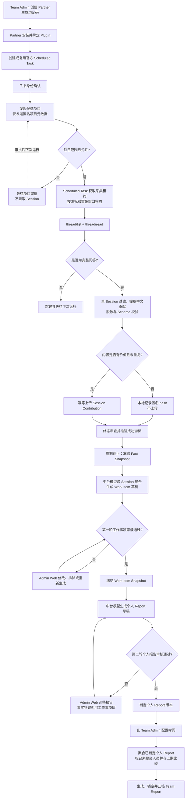

# Partner Report Agent

## 项目工作流

### 1. Partner 绑定

Team Admin 先使用工作邮箱创建 Partner，并为其生成绑定码。Partner 安装 Plugin 后，通过绑定码把本地 Codex 与数据中台连接起来；同一 Partner 可以绑定多个 Plugin Instance，各实例上传的数据最终都归入同一个 Partner。

绑定完成后，Plugin 创建或复用官方 Codex Scheduled Task。任务默认每天在新聊天中运行，后续以 Partner 在 Codex Scheduled 面板中的时间、模型、推理强度和通知配置为准。

### 2. 身份确认与项目授权

Plugin 先通过飞书完成 Partner 身份确认。身份确认前不发现项目、不读取 Session，也不上传数据。

身份确认后，Plugin 只通过 `thread/list` 发现候选项目，并在本地排除临时目录和系统任务；首次项目范围卡只在中台登记的项目根目录白名单内筛选最近 7 天有已知 Session 活动的项目，后续运行按原有逻辑发现新增项目。中台收到的候选信息仅包含匿名项目键、显示名、首次发现周期和 Session 数量，不包含本机绝对路径、Git 信息或 Codex Session 标识。

候选项目通过飞书完成采集范围审批。只有已允许的项目才能调用 `thread/read`、进入模型处理并上传贡献；被拒绝或待审批的项目不会读取内容。首次审批允许的项目立即生效，后续新发现项目的允许结果从下个报告周期生效。

### 3. 定时采集与 Session 提取

Scheduled Task 触发后，Plugin 先获取本地租约，避免自动采集与手动采集并发。首次运行只检查最近一天且位于当前报告周期内的 Session；后续从上次完整成功的游标继续扫描，并保留 24 小时重叠窗口以覆盖迟到更新。

Plugin 对获准项目依次执行 `thread/list` 和 `thread/read(includeTurns)`，只保留完整的“用户问题 + Assistant `final_answer`”问答。中断、取消、失败或没有最终回复的 Turn 不进入提取流程。

每个候选 Session 都会根据完整问答计算匿名 Session key 和稳定内容 hash：

- 已接收或已忽略且内容未变化的 Session 直接跳过。
- 内容发生变化的 Session 重新构建并提取当前修订。
- 无项目价值的 Session 只在本地记录匿名 hash，不上传。
- 有价值的 Session 由当前 Scheduled Task 选择的模型生成中文标题、摘要和贡献正文，经过脱敏、字段约束和 Schema 校验后立即幂等上传。

Plugin 只负责单个 Session 内的事实提取，不在本地进行跨 Session 聚合或生成报告。全部任务处理完后还会执行一次独立终态审查；只有队列清空、没有失败且中台确认完成时才推进成功游标。失败或中断不会推进游标，下次运行会重新覆盖该范围。

### 4. 周期冻结与工作事项聚合

到达工作卡片聚合时间后，中台按 `tenant_id + partner_id + period_id` 冻结本周期 Fact Snapshot。同一 Partner 的多个 Plugin Instance 贡献会在这里合并。

中台模型基于冻结快照，按项目、工作事项和时间顺序对多个 Session 的事实进行聚类、去重和状态重建，生成可追溯到原始 Fact 的 Work Item 草稿。无法可靠归属项目的事项保持独立，不会为了提高聚合率而强行合并。

### 5. 工作事项审核

当前由 Admin 在 Web 中代表 Partner 完成第一轮审核。Admin 可以逐项确认、排除、修改或重新生成工作事项；修改先形成预览，确认后才应用。

当最后一项完成审核后，中台冻结不可变的 Work Item Snapshot。若所有事项都被排除，本周期不会继续生成个人报告。

### 6. 个人报告生成与审核

Work Item Snapshot 冻结后，中台自动创建生成任务，由中台模型基于已确认的工作事项生成个人 Report 草稿，Plugin 不参与该过程。

Admin 在 Web 中代表 Partner 完成第二轮审核，可以调整报告结构、重点和表达。事实有误时需要回到工作事项层修正；审核通过后，个人 Report 被锁定为不可变版本，并保留其引用的 Work Item Snapshot。

### 7. Team Report 生成与归档

Team Report 不会因为所有人提前完成审核而提前生成。只有到达 Team Admin 单独配置的 Team Report 时间后，中台才读取届时已锁定的个人 Report，按项目聚合团队进展，并显式标记未提交人员。

中台在团队维度整理成果、风险、依赖和下一步，并与上期报告进行比较，生成并锁定 Team Report。工作事项版本、个人 Report 版本、Team Report 版本及其引用关系都会保留，形成可追溯的报告归档。
