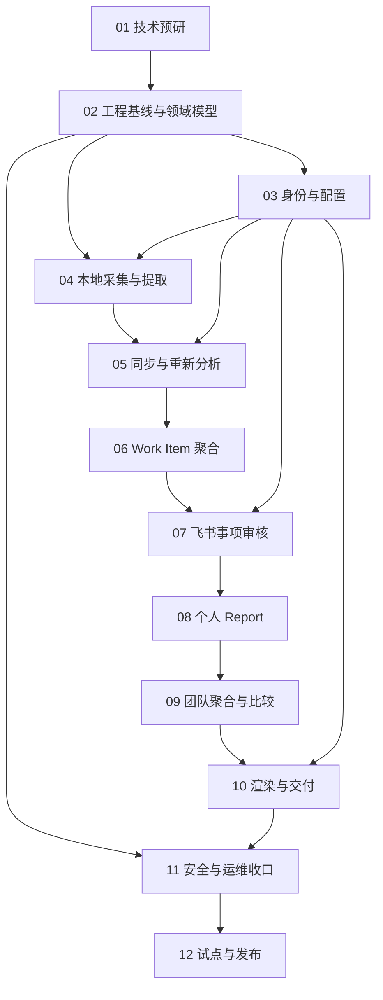

# Partner Report Agent 开发总览与实施路线图

> 文档定位：PRD 的工程实施索引。所有板块按依赖顺序编号，需求口径以同目录 `PRD.md` 为来源。
>
> 适用范围：MVP（Phase 0 至 Phase 2），增强能力不在本轮开发主链路内。

## 0. 当前实施路线（2026-08-03）

当前迭代只交付以下闭环：

```text
Hook 记录 Session ID / Turn ID / 最后活动时间
-> 120 分钟静默后 Runner 读取增量 Turn
-> 只取用户提问与模型 final_answer
-> 本地提取结构化事实并同步
-> 数据中台在一周内持续接收 Fact，不做项目聚合
-> 周周期 cutoff_at 到达，中央 Worker 幂等创建一次聚合任务
-> Runner 按项目生成项目卡片
-> Partner 在数据中台一审项目卡片
-> 一审通过后 Runner 生成个人周报
-> Partner 在数据中台二审周报并确认
```

本阶段启用数据中台内的项目卡片一审和个人周报二审；不引入飞书审核、团队 Report、Monitor 投递和 PDF。`120 分钟静默`只控制单个 Session 的提取时间，`一周截止`控制整个周期的聚合时间，两者不能混为一次触发。

## 1. 完整产品目标

以可追溯、可审核、默认不上传完整聊天为约束，交付以下闭环：

```text
本地 Session
-> Hook 活动标记与 2 小时静默窗口
-> 本地 Runner 自动提取和心跳
-> 本地结构化事实
-> 服务端 Work Item
-> Partner 事项审核
-> Partner 个人 Report 审核与提交
-> 团队聚合和上期比较
-> 飞书正文 + PDF 单向交付 Monitor
```

MVP 的完成标准不是“能够生成文本”，而是以下条件同时成立：

1. 每个事实性结论可追溯到 Session Fact 或 Partner 补充。
2. 未经 Partner 确认的个人内容不能进入团队报告。
3. 数据覆盖不足必须显式展示，不能用推断补齐。
4. Monitor 只能接收最终团队报告，不能审核或下钻个人数据。
5. 同步、回调、生成和交付均具备幂等、重试与审计能力。
6. Partner 除首次安装、绑定和 Hook 信任外，不需要手动触发日常 Session 同步。

## 2. 开发板块与顺序

| 顺序 | 开发板块                       | 核心产物                                                   | 前置依赖   | 阶段门禁                                       |
| ---- | ------------------------------ | ---------------------------------------------------------- | ---------- | ---------------------------------------------- |
| 01   | 技术预研与可行性验证           | 能力验证报告、脱敏样本、基准线、ADR                        | 无         | 关键外部能力均有真实验证结果                   |
| 02   | 工程基线与领域模型             | 服务骨架、Schema、状态机、迁移和契约测试                   | 01         | 核心不变量和跨模块契约冻结为 v1                |
| 03   | 租户配置、身份与插件绑定       | Team/Partner/Monitor 配置、GitHub Marketplace、绑定与升级  | 02         | AC-01 和基础租户隔离通过                       |
| 04   | Codex Plugin 本地采集与提取    | Hook、活动状态、2 小时静默窗口、Runner、Cursor、本地提取器 | 01、02、03 | 真实 Session 可在无手动触发下增量产出合规 Fact |
| 05   | 事实同步、覆盖率与重新分析     | Ingestion、Coverage、Re-analysis 租约队列                  | 02、03、04 | AC-02、AC-02A、AC-07 通过                      |
| 06   | Work Item 聚合与重要性排序     | 聚类、时间线、稳定 ID、快照和评测                          | 02、05     | AC-03、AC-04 达标                              |
| 07   | 飞书事项审核与变更引擎         | 审核卡、NL 修改、Preview/Apply、乐观锁                     | 03、05、06 | AC-05、AC-06 通过                              |
| 08   | 个人 Report 生成、审核与提交   | 生成器、质量检查、版本、不可变快照                         | 06、07     | AC-08 通过，个人主链路完成                     |
| 09   | 团队聚合与跨周期比较           | 项目汇总、独立工作、状态变化、覆盖信息                     | 08         | AC-09、AC-10 通过                              |
| 10   | 团队报告渲染与 Monitor 交付    | 可视化、PDF、飞书终态消息、交付幂等                        | 03、09     | AC-10A 通过                                    |
| 11   | 安全、审计、保留与可观测性收口 | 权限矩阵、删除、审计、指标、告警、补跑                     | 02 至 10   | AC-11、AC-12 和 NFR 验收通过                   |
| 12   | 端到端测试、试点与发布         | E2E 套件、压测、演练、灰度与复盘                           | 01 至 11   | 最小演示场景和试点退出标准通过                 |

安全、审计和可观测性不是到第 11 板块才开始。第 02 板块建立基础能力，第 03 至 10 板块必须随功能写入审计事件、指标和权限测试，第 11 板块负责统一收口和生产门禁。

## 3. 依赖关系



可以并行的工作：

- 01 中的 Codex、飞书、提取评测三条 Spike 可并行。
- 03 完成接口契约后，04 的本地实现与 05 的服务端 Ingestion 可并行。
- 09 的比较算法与 10 的 PDF 模板可在结构化 Team Report Schema 冻结后并行。

不可绕过的关键路径：`02 -> 05 -> 06 -> 07 -> 08 -> 09 -> 10 -> 12`。

## 4. 全局工程约束

### 4.1 数据与追溯

- 所有业务表、缓存键、对象路径和队列消息必须携带 `tenant_id`。
- Fact 必须保留 `session_id`、时间、提取器版本和有限证据引用。
- Work Item 必须保留 `fact_id` 集合；报告必须引用不可变 Snapshot。
- Partner 补充事实与 AI 提取事实分开存储和展示。
- 完整 transcript 默认只在本地存在，不进入服务端日志、队列或对象存储。

### 4.2 幂等与版本

- 写接口必须接受或生成稳定的 `idempotency_key`。
- 可编辑聚合对象使用整数 `version` 和乐观锁。
- 提交后的 Snapshot 不原地修改；变更创建新版本。
- 外部回调先持久化接收事件，再异步执行耗时任务。

### 4.3 时间

- 数据库存储 UTC 时间，边界计算使用 Team 配置时区。
- 周期使用稳定 `period_id`，不能只依赖自然语言日期。
- 截止快照包含截止时仍活跃的 Session，并标记其进行中状态。

### 4.4 AI 输出

- 每一级 AI 输出必须通过版本化 JSON Schema 校验。
- Schema 无效允许有限重试；重试耗尽后进入可观测的失败队列。
- 不允许一个 Prompt 从原始 Session 直接生成团队报告。
- “已完成”、数字、百分比和状态变化必须有来源或 Partner 补充标记。

## 5. PRD 口径冲突与实施基线

以下内容需要在开发前确认；为避免阻塞文档编写，先给出推荐实施口径：

| 议题             | PRD 中的冲突或空缺                                        | MVP 实施基线                                                                                      |
| ---------------- | --------------------------------------------------------- | ------------------------------------------------------------------------------------------------- |
| Team Report 状态 | 13.2 包含 `MONITOR_REVIEW`，但多处明确 Monitor 不参与审核 | 改为 `READY_FOR_DELIVERY`；Monitor 仅接收终态内容                                                 |
| 设备范围         | 7.1 定义单设备；边界场景又描述多设备绑定                  | MVP 每个 Partner 仅允许一个 active Plugin Instance；额外实例提示不支持，不承诺去重正确性          |
| Web Console      | Phase 3 才有 Web 批量审核，但 Team Admin 配置为 MVP 必需  | MVP 只做最小管理控制台或受保护管理 API；Partner 批量审核工作台仍属增强                            |
| 数据保留         | 保留时长和离职策略未确定                                  | Schema 和任务支持可配置策略；生产试点前必须完成业务决策，不在代码中写死期限                       |
| 飞书“一次性交付” | 文件上传和消息发送是多步外部调用                          | 采用状态机实现 exactly-once effect：同一报告版本最多产生一条成功交付消息                          |
| Phase 0 退出标准 | 要求生成并审核个人 Report，超出单点 Spike                 | 使用最薄纵向链路验证，不要求 Phase 1 的完整质量和运维能力                                         |
| 自动提取触发     | Hook 异步执行不受支持，服务端也不能唤醒 Partner 设备      | Hook 只更新活动时间；Local Runner 每 5 分钟检查，默认静默 120 分钟后通过官方非交互 Codex 执行提取 |
| Monitor 内容粒度 | Monitor 不下钻个人数据，但需要了解每人本周进展            | Team Report 可展示每位 Partner 的高层任务进度，不展示 Session、Evidence、命令、代码细节或个人排名 |

上述基线应形成 ADR；产品负责人作出不同决定时，先更新本索引和受影响板块，再修改实现。

## 6. 需求覆盖索引

| PRD 范围             | 主责文档                    |
| -------------------- | --------------------------- |
| FR-01                | 03、04                      |
| FR-02、FR-03         | 04、05                      |
| FR-04、FR-05         | 06                          |
| FR-06                | 07                          |
| FR-07                | 05、07                      |
| FR-08                | 08                          |
| FR-09、FR-10         | 09                          |
| FR-11、FR-11A、FR-12 | 10                          |
| FR-13                | 02、11                      |
| 安全与隐私           | 02、03、04、05、11          |
| NFR-01 至 NFR-05     | 各功能板块 + 11             |
| AC-01 至 AC-12       | 12 统一编排，各板块先行验收 |

## 7. 全局 Definition of Done

每个板块只有满足以下条件才算完成：

1. 功能代码、数据迁移、配置和回滚路径齐全。
2. 单元、契约、集成和关键权限测试通过。
3. 幂等、重试、超时和部分失败场景有明确行为。
4. 关键操作写入结构化日志、指标和审计事件。
5. 不在日志、错误、Prompt 或飞书内容中泄露敏感数据。
6. API、Schema、状态机和运行手册同步更新。
7. 对应 PRD 验收标准有可重复执行的证据。

## 8. 文档清单

- [01-技术预研与可行性验证](./01-技术预研与可行性验证.md)
- [02-工程基线与领域模型](./02-工程基线与领域模型.md)
- [03-租户配置身份与插件绑定](./03-租户配置身份与插件绑定.md)
- [04-Codex-Plugin本地采集与提取](./04-Codex-Plugin本地采集与提取.md)
- [05-事实同步覆盖率与重新分析](./05-事实同步覆盖率与重新分析.md)
- [06-Work-Item聚合与重要性排序](./06-Work-Item聚合与重要性排序.md)
- [07-飞书事项审核与变更引擎](./07-飞书事项审核与变更引擎.md)
- [08-个人Report生成审核与提交](./08-个人Report生成审核与提交.md)
- [09-团队聚合与跨周期比较](./09-团队聚合与跨周期比较.md)
- [10-团队报告渲染与Monitor交付](./10-团队报告渲染与Monitor交付.md)
- [11-安全审计保留与可观测性](./11-安全审计保留与可观测性.md)
- [12-端到端测试试点与发布](./12-端到端测试试点与发布.md)
