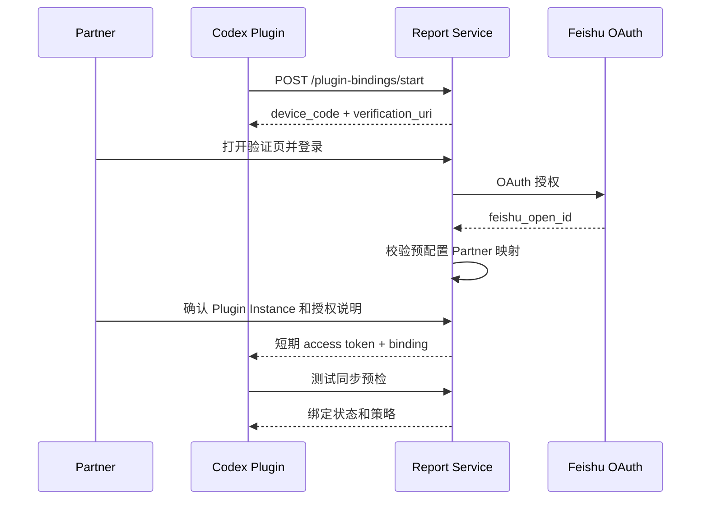

# 03 租户配置、身份与插件绑定

> 对应 PRD：4、9.1、9.8 至 9.10、FR-01、16.1、16.5、17.1、17.3、AC-01。
>
> 前置依赖：02 工程基线与领域模型。

## 1. 目标

建立可信的 Team、Partner、Monitor、项目和 Plugin Instance 关系，使后续上传、审核和交付都能从认证上下文确定租户与主体，且撤销后立即失效。

## 2. MVP 范围

包含：

- Team Admin 最小配置入口。
- Team、Partner、Monitor 接收目标、Project 和 ReportPolicy 管理。
- Plugin 设备码或 OAuth 绑定。
- GitHub Marketplace 稳定 Release 安装、升级和最低版本策略。
- Partner 飞书 OAuth 身份确认。
- 短期 Plugin Token、刷新和撤销。
- 单设备约束、版本状态和最近在线信息。
- 首次设置向导所需的配置读写。
- `PLUGIN_DATA`、本地 SQLite 和系统 Keychain 跨兼容版本升级保留。

不包含：

- Monitor 登录或自助配置。
- Partner 批量审核 Web 工作台。
- 多设备一致性承诺。
- 企业目录自动同步，除非已有稳定数据源可直接接入。

## 3. 权限主体

| 主体 | 允许操作 | 明确禁止 |
| --- | --- | --- |
| Partner | 管理自己的绑定、授权范围、偏好和个人审核 | 读取其他 Partner 数据 |
| Plugin Instance | 上传所属 Partner 的结构化 Fact、领取自己的任务 | 读取报告或其他实例任务 |
| Team Admin | 配置团队、成员、项目、周期、Monitor 目标 | 默认读取 Evidence 正文 |
| Monitor | 无服务端交互权限，仅接收飞书终态消息 | 登录下钻、审核、修改、追问 |
| Worker/Service | 在服务身份范围内处理任务 | 跨租户通配访问 |

权限检查使用“主体 + tenant + resource owner + action”，不能只判断角色名。

## 4. 配置模型

### 4.1 Team 配置

```text
Team
  timezone
  report_type
  period_rule
  partner_cutoff
  team_delivery_time
  report_template_id
  reminder_policy
  retention_policy_id
  session_quiet_period_minutes: 120
  plugin_heartbeat_interval_minutes: 5
```

周期规则变更只影响未来周期；已开始周期需要显式迁移或保持旧配置快照。

### 4.2 项目配置

```text
Project
  project_id
  canonical_name
  aliases[]
  allowed_paths[]
  external_ids[]
  status
```

路径由 Partner 本地配置做最终授权，服务端 Project 配置不能扩大本地读取范围。

### 4.3 Monitor 目标

```text
MonitorTarget
  target_type: user | chat
  feishu_target_id
  display_name
  enabled
```

保存前发送测试消息或调用可达性检查；正式交付只使用 Admin 已确认的 enabled 目标。

## 5. 绑定流程



安全要求：

- 设备码短时有效、单次使用、不可枚举，并支持用户拒绝。
- OAuth `state` 和 PKCE（适用时）防止回调劫持。
- 只有 Admin 预配置或允许邀请的 Partner 才能完成映射。
- 不允许 Partner 在聊天中粘贴长期 API Key。
- Token 只包含必要 Scope，服务端保存 Refresh Token 时加密。
- GitHub Marketplace 固定稳定 Release/tag；升级只替换 Plugin 代码和 Schema，不覆盖 `PLUGIN_DATA`。
- Plugin `name` 保持稳定；兼容升级复用 `plugin_instance_id`、项目范围、排除规则和 Keychain Token。
- Hook 定义哈希变化时允许 Codex 重新要求信任，升级状态在 Admin 中显示，不能静默绕过。

## 6. API

### 6.1 Plugin

- `POST /v1/plugin-bindings/start`
- `POST /v1/plugin-bindings/complete` 或设备码轮询端点
- `GET /v1/plugin-bindings/me`
- `POST /v1/plugin-bindings/{id}/refresh`
- `DELETE /v1/plugin-bindings/{id}`

`me` 返回 Plugin 需要的最小策略：Partner/Team 标识、时区、项目元数据、Schema 版本范围、Evidence 策略、静默窗口、心跳间隔、最低 Plugin 版本和服务端时间。

### 6.2 Admin

- Team、Partner、Project、MonitorTarget、ReportPolicy 的 CRUD。
- 配置变更 Preview 和审计记录。
- 绑定状态、Plugin 版本、`last_seen_at` 和测试同步结果查询。

Admin API 走独立权限和认证，不与 Plugin Token 共用 Scope。

## 7. 首次设置向导

向导状态：

```text
IDENTITY_CONNECTED
-> PROJECT_SCOPE_CONFIGURED
-> PRIVACY_CONFIRMED
-> SYNC_TESTED
-> ENABLED
```

每一步可恢复并显示未完成原因。最终启用前必须检查：

- Hook 已配置并信任。
- 本地历史记录可读。
- include/exclude 路径不冲突。
- Evidence 选择已明确。
- 网络域名和 Scheduled Task 权限满足。
- 测试同步的发现、排除和失败数可解释。

## 8. 撤销与实例管理

撤销流程必须原子地完成：

1. Binding 状态改为 `revoked`。
2. Access/Refresh Token 和服务端会话失效。
3. 后续上传、任务领取和刷新均返回拒绝。
4. 写入审计事件并创建按策略执行的数据删除请求。
5. Plugin 本地删除服务 Token；本地业务数据是否删除由明确 UI 让 Partner 决定。

MVP 单设备规则：已有 active instance 时，新实例绑定必须提示先撤销/迁移旧实例。不能在服务端静默接受两个实例后声称支持多设备。

## 9. 测试

- 正常绑定、过期设备码、重复确认、用户拒绝和 OAuth state 错误。
- 飞书账号与预配置 Partner 不匹配。
- Partner A 的设备码不能绑定 Partner B。
- 被撤销 Token 立即无法上传或领取任务。
- Refresh Token 轮换和旧 Token 重放。
- 额外设备绑定被明确阻止。
- Monitor 目标无法用于 Partner 审核，Partner 目标无法被误作团队交付目标。
- Admin 跨租户访问被拒绝并审计。
- 最低 Plugin 版本不满足时返回可理解的升级状态。

## 10. 可观测与审计

指标：绑定开始/成功/失败率、OAuth 失败原因、活跃实例数、版本分布、Token 刷新失败、撤销延迟、Monitor 目标可达率。

审计事件：创建/更新 Team 配置、Partner 映射、Project 别名、Monitor 目标、绑定激活、Token 轮换、撤销和管理访问。

日志不得包含 OAuth Token、设备码完整值或飞书凭证。

## 11. 验收与退出标准

- 新 Partner 可以完成绑定并准确映射 `tenant_id + partner_id + feishu_open_id + plugin_instance_id`。
- 其他 Partner 不能使用该绑定，跨租户测试通过。
- 撤销后新请求立即失效，已有异步任务在执行前再次检查绑定状态。
- Admin 可配置 MVP 所需 Team、Partner、Project、周期和 Monitor 接收目标。
- Monitor 无登录、审核或个人数据访问入口。
- 首次设置状态可恢复，失败原因可观测。
- 满足 PRD AC-01，并为 AC-11、AC-12 提供身份基础。
