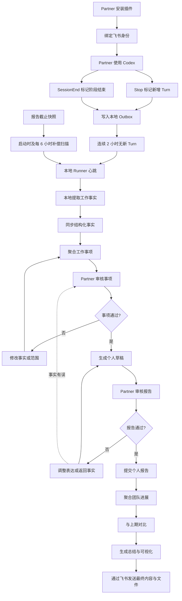
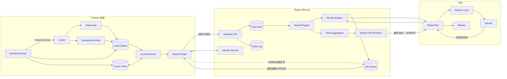

# Partner Report Agent 产品需求文档

> 当前实施说明（2026-08-03）：本轮只实现本地增量提取、结构化事实同步、项目聚合和数据中台直接展示。飞书审核、个人/团队 Report、Monitor 与 PDF 仍是后续产品目标，不是当前版本的前置流程。

## 1. 产品摘要

Partner Report Agent 是一个面向团队工作汇报的 Human-in-the-loop 系统。

系统在 Partner 自己的 Codex 环境中读取其已授权的本地 Session，在本地提取结构化工作事实，并将不包含完整原始聊天的 Session 工作事实同步到 Report Service。系统随后通过飞书向 Partner 推送工作事项审核，Partner 确认事实、补充遗漏、调整侧重点后，系统生成个人 Report 并进行第二轮审核。

所有 Partner 的个人 Report 提交后，系统按项目聚合团队进展，保留无法归入公共项目的独立工作事项，与上期 Report 比较，生成团队总结和可视化内容，最终通过飞书消息和文件附件发送给 Monitor。Monitor 仅作为最终团队报告的接收者，不参与报告审核、修改或追问流程。

产品核心原则：

> 报告不复述 Partner 聊了什么，而是说明工作状态发生了什么变化、产生了什么结果、有什么风险、下一步是什么，以及需要谁采取行动。

## 2. 背景与问题

### 2.1 当前问题

1. Partner 的有效工作信息分散在多个 Codex Session 中，人工回顾成本高。
2. Session 中包含大量探索、调试和重复讨论，直接摘要容易形成流水账。
3. AI 自动总结可能混淆“讨论”“计划”“进行中”和“完成”。
4. Partner 提交的个人报告格式、粒度和侧重点不一致，人工生成最终团队汇总成本高。
5. 只比较两期自然语言报告，难以准确识别新增、推进、完成和阻塞。
6. Partner 使用独立 Codex，飞书机器人和中心服务不能天然读取其聊天记录。
7. 原始 Codex 聊天可能包含代码、密钥、客户信息或其他敏感数据，不适合默认集中上传。

### 2.2 产品机会

在 Partner 本地完成 Session 事实提取，在服务端保存可追溯的结构化工作事实，并通过飞书建立双层审核，可以同时满足：

- 降低 Partner 整理报告的时间成本。
- 提高报告事实准确性和可读性。
- 让 Partner 保持最终控制权。
- 让团队汇总和上期比较具备稳定的数据基础。
- 降低集中存储完整聊天记录带来的隐私风险。

## 3. 产品目标

### 3.1 MVP 目标

1. Partner 可以安装并授权一个 Codex Report Plugin。
2. 插件可以发现指定时间段内的本地 Codex Session，并报告数据覆盖率。
3. 插件在本地逐 Session 提取结构化工作事实并完成第一轮聚合。
4. Report Service 可以通过飞书向对应 Partner 推送工作事项审核。
5. Partner 可以通过按钮、表单和自然语言完成事实审核与修改。
6. 工作事项通过后，系统生成个人 Report 草稿并进行第二轮审核。
7. 只有 Partner 确认的个人 Report 才进入团队汇总。
8. 系统可以按项目聚合团队进展，保留独立工作，并与上期比较。
9. 系统可以通过飞书向 Monitor 发送最终团队报告、基础可视化内容和报告文件附件。
10. 所有报告结论可以追溯到 Session 事实或 Partner 补充事实。

### 3.2 成功标准

- Partner 完成一份周报的中位审核时间不超过 10 分钟。
- 试点期 Partner 周报按时提交率达到 90% 以上。
- 工作事项中 100% 的事实性结论具备来源或标记为 Partner 补充。
- 80% 以上的 Partner 修改可在飞书审核闭环中完成。
- 最终团队报告可以按配置时间成功发送到 Monitor 的飞书会话，并支持打开或下载报告附件。
- 不发生跨 Partner、跨团队的数据越权。

### 3.3 非目标

MVP 不包含：

- 个人绩效评分、排名或基于消息数量衡量贡献。
- 自动提交未经 Partner 审核的个人 Report。
- 默认上传完整 Codex 原始聊天记录。
- Monitor 审核、修改、追问或重新生成团队报告。
- Monitor 下钻查看个人 Report、工作事实、证据摘要或 Partner 提交进度。
- 支持所有外部聊天平台。
- 对 Codex 云端、其他设备或关闭历史记录后的 Session 作完整性保证。
- 高自由度的 BI 仪表盘和自定义报表设计器。

## 4. 用户与角色

### 4.1 Partner

团队成员。拥有以下权限：

- 安装和授权本地 Codex Plugin。
- 选择可用于报告的项目、Session 和时间范围。
- 查看并审核自己的工作事项。
- 查看有限的证据摘要。
- 补充、修正、排除、合并工作事项。
- 调整本期侧重点和长期表达偏好。
- 审核并提交个人 Report。
- 撤销授权和请求删除自己的同步数据。

### 4.2 Monitor

最终团队报告接收者。仅需：

- 在指定飞书单聊或群聊中接收最终团队报告消息。
- 查看消息正文中的团队总结和可视化摘要。
- 打开或下载随消息发送的最终报告文件。

Monitor 不安装 Codex Plugin，不需要登录 Report Service，不承担任何配置、审核或反馈操作，也不能通过本产品访问个人 Report、原始 Session 或证据摘要。

### 4.3 Team Admin

负责组织配置和权限管理：

- 配置团队、Partner、Monitor 和项目映射。
- 配置报告周期、截止时间、模板和通知策略。
- 管理飞书应用可用范围。
- 管理数据保留、安全策略和插件分发策略。
- 查看同步状态和审计记录，但不默认查看原始证据。

### 4.4 Report Agent

系统代理，负责：

- Session 事实提取。
- 工作事项识别、去重和时间线重建。
- 重要性排序。
- 修改意图解析。
- 个人和团队报告生成。
- 上期比较、质量检查、提醒和交付。

## 5. 关键术语

| 术语                | 定义                                                      |
| ------------------- | --------------------------------------------------------- |
| Session             | Partner 与 Codex Agent 的一次独立对话线程                 |
| Session Work Fact   | 从一个 Session 中提取的结构化工作事实                     |
| Work Item           | 跨一个或多个 Session 聚合出的稳定工作事项                 |
| Evidence            | 支撑事实结论的 Session、时间、消息摘要或 Partner 补充记录 |
| Individual Report   | 经 Partner 确认的个人周报或月报                           |
| Team Report         | 基于已提交个人 Report 生成的团队报告                      |
| Review Cycle        | 一次工作事项审核或 Report 审核循环                        |
| Re-analysis Request | 服务端要求本地插件重新读取 Session 的请求                 |
| Coverage            | 指定周期内可发现、可读取、成功分析的 Session 覆盖情况     |

## 6. 已知平台能力与约束

本节记录 2026-07-31 验证过的能力。进入开发前应再次核对平台版本。

### 6.1 Codex

1. Codex Plugin 可以打包 Skill、MCP Server 和生命周期 Hook。
2. `Stop` Hook 在一个 Agent Turn 停止时触发，可以获得 `session_id`、`turn_id`、`transcript_path` 和最后一条 Assistant 消息，适合把 Session 标记为有新增内容。
3. `SessionEnd` Hook 可以获得 `session_id` 和 `transcript_path`，但只对主线程生效，不对 Subagent 生效。
4. `SessionEnd` 在对话被归档或删除、Codex 正常关闭，或对话空闲且没有客户端保持打开约 30 分钟后触发；切换到其他对话不会立即触发。
5. 当前 `SessionEnd.reason` 统一为 `other`，不能区分归档、关闭或空闲。
6. 一个 Session 在 `SessionEnd` 后仍可能恢复并产生新 Turn，因此 `SessionEnd` 只能视为阶段性汇总信号。
7. `SessionEnd` Hook 最长执行时间较短，当前不适合直接执行完整 LLM 分析。
8. Hook 中的 transcript 文件格式不是稳定接口，不应作为长期解析协议。
9. Codex App Server 提供 `thread/list` 和 `thread/read(includeTurns)` 等线程读取能力，适合作为本地集成边界。
10. Codex 桌面端 Scheduled Tasks 可以在本地项目中调用 Skill 和 Plugin。
11. 本地 Scheduled Task 依赖电脑开机、Codex 桌面应用运行以及适当的文件和网络权限。
12. Codex CLI 和 IDE 当前不是 Scheduled Tasks 的管理入口。
13. Partner 关闭历史记录、删除 Session、使用多个设备或云端 Session 时，可能出现覆盖缺口。

官方参考：

- [Codex Plugins](https://learn.chatgpt.com/docs/build-plugins)
- [Codex Hooks](https://learn.chatgpt.com/docs/hooks)
- [Codex Scheduled Tasks](https://learn.chatgpt.com/docs/automations)
- [Codex App Server](https://learn.chatgpt.com/docs/app-server)

### 6.2 飞书

1. 飞书新版卡片 JSON 2.0 支持标题、富文本、标签、分栏、按钮、下拉选择、输入框、表单、日期选择、折叠面板和表格等组件。
2. Partner 操作卡片后，飞书可以向开发者服务端发送回调。
3. 服务端可以基于回调更新整张卡片或局部组件。
4. 复杂、耗时的 LLM 处理不应阻塞卡片回调，应先快速确认接收，再异步更新卡片。
5. 卡片适合通知、单项审核和简单修改，不适合大量事项的复杂批量编辑。

官方参考：

- [飞书新版卡片搭建工具](https://open.feishu.cn/document/uAjLw4CM/ukzMukzMukzM/feishu-cards/feishu-card-cardkit/feishu-cardkit-overview?from=botpush)
- [飞书卡片输入框与表单](https://open.feishu.cn/document/feishu-cards/card-json-v2-components/interactive-components/input)
- [飞书卡片交互回调](https://open.feishu.cn/document/uAjLw4CM/ukzMukzMukzM/feishu-cards/handle-card-callbacks?lang=zh-CN)
- [飞书卡片局部更新](https://open.feishu.cn/document/cardkit-v1/streaming-updates-openapi-overview?lang=zh-CN)

## 7. 产品范围与核心决策

### 7.1 MVP 支持范围

- 报告类型：周报优先，数据模型兼容月报。
- 默认周期：周一 00:00 至周日 23:59，按 Team 时区配置。
- Codex 客户端：macOS Codex 桌面端。
- 设备范围：单设备。
- Codex 来源：当前设备、本地 `CODEX_HOME` 中保存的 Session。
- 后续范围：CLI、IDE、多设备和云端 Session 不进入 MVP 完整性承诺。
- 飞书来源：企业自建应用机器人；Partner 审核使用单聊，Monitor 最终交付支持单聊或群聊。
- 审核方式：飞书卡片 + 飞书自然语言回复。
- Partner 审核输出：飞书卡片和 Web 详情页。
- Monitor 交付输出：飞书最终消息 + 文件附件；MVP 文件格式为 PDF。
- 原始聊天：默认只在 Partner 本地处理。
- 中心服务：保存结构化 Session Work Facts、Work Items、报告版本和有限证据摘要。

### 7.2 数据同步策略

采用“Session 静默后自动增量提取、周期结束聚合”，不采用“每个 Turn 立即提取”或“周五首次读取全周 Session”。默认静默窗口为 2 小时，由 Team Admin 统一配置。

Session 采集使用五种互补信号：

1. `Stop` Hook：每个 Agent Turn 停止后，将 Session 标记为 `DIRTY`，更新最新 `turn_id`、`last_activity_at` 和 `quiet_until`；Hook 不读取完整线程、不执行 AI、不联网。
2. `SessionEnd` Hook：记录阶段结束，但仍遵守 2 小时静默窗口，不认为 Session 永久结束。
3. Local Runner：默认每 5 分钟检查一次；当 `now >= quiet_until` 时自动读取、提取和同步，并至少每 5 分钟向中心服务发送不含 Session 正文的健康心跳。
4. 补偿扫描：Plugin 启动时及至少每 6 小时扫描本地线程列表，补偿 Hook 未触发、未信任、超时或应用异常退出。
5. 报告截止快照：到达周报或月报截止时间后，强制扫描本周期 Session；仍活跃的 Session 也生成当前快照并标记进行中。

每个 Session 保存增量处理游标：

```text
session_id
+ last_seen_turn_id
+ last_processed_turn_id
+ last_activity_at
+ quiet_until
+ content_hash
+ processing_state
```

同一 Session 恢复后，只处理新增 Turn，并更新已有 Work Item 的状态链。

原因：

- 降低一次性处理的 Token 和时间成本。
- 减少 Session 删除或历史关闭造成的数据丢失。
- 修改时间范围时可以直接重用已同步事实。
- 支持失败重试和覆盖率监控。
- 周期结束时只需聚合，不必重新读取全部聊天。

### 7.4 Re-analysis 交付策略

Report Service 不假设可以主动唤醒 Partner 设备上的 Codex Plugin。

- 服务端把 Re-analysis Request 写入待领取队列。
- 本地 Runner 在每次心跳周期轮询待处理请求，无需 Partner 手动运行 Skill。
- Partner 可以从飞书点击“立即重新同步”，该请求在下一个 Runner 周期绕过静默窗口。
- Plugin 离线时，飞书必须显示“等待本地 Codex”，不得显示处理完成。
- 请求支持超时、取消、幂等和重复领取保护。

### 7.3 隐私策略

采用混合模式：

- 完整原始 Session 默认留在 Partner 本地。
- 上传结构化工作事实、Session 标识、时间、项目和有限证据摘要。
- 如果服务端已有足够事实，修改在服务端重新聚合。
- 如果必须重新深挖原始聊天，创建 Re-analysis Request，由本地插件领取并执行。
- Partner 可以选择对特定 Session 完全排除，或授权上传更详细证据。

## 8. 端到端工作流



## 9. 用户流程

### 9.1 Partner 首次安装与绑定

1. Team Admin 分发 GitHub Marketplace 稳定版本入口；Partner 通过 Codex 官方 Plugin 命令或 Plugin Directory 安装。
2. Partner 安装并启用 Plugin，只在首次安装或 Hook 内容变化时审查 Hook 信任。
3. Codex 要求 Partner 审查并信任 Plugin Hook。
4. Partner 调用插件的连接流程。
5. Plugin 通过 OAuth 或一次性设备码连接 Report Service。
6. Partner 在 Web 授权页登录飞书并确认身份。
7. Report Service 建立以下绑定：

```text
tenant_id
  + partner_id
  + feishu_open_id
  + plugin_instance_id
  + codex_user_binding
```

8. Partner 配置：
   - 确认当前使用 macOS Codex 桌面端和单设备模式。
   - 确认本地 Session 历史记录已启用。
   - 默认报告周期。
   - 包含或排除的项目目录。
   - 是否上传有限证据摘要。
   - 自动同步静默窗口，Team 默认 120 分钟。
   - 是否允许访问 Report Service 网络域名。
9. 系统执行一次只读预检，展示可发现 Session 数量，不立即上传完整数据。
10. 系统执行一次测试同步，展示读取、排除、失败和待处理数量。
11. Partner 确认后注册并启动 Local Runner；后续 Marketplace 升级复用同一 `PLUGIN_DATA`、Plugin Instance 和系统 Keychain 凭证，不重复绑定。

### 9.2 Session 发现与本地提取

1. 每个 Agent Turn 停止时，`Stop` Hook 只执行快速操作：记录 `session_id`、`turn_id`、时间和项目目录，并把 Session 标记为 `DIRTY`。
2. `SessionEnd` 触发时记录阶段结束；同一 Session 后续恢复时仍沿用原 `session_id`，并重新计算 2 小时静默截止时间。
3. 两类 Hook 都只写入 Plugin 本地 Outbox，不直接运行 LLM 提取或网络长任务。
4. Local Runner 每 5 分钟检查活动状态；连续 2 小时没有新 Turn 的 Session 自动进入提取，不要求 Partner 手动触发。
5. Plugin 启动时及至少每 6 小时执行补偿扫描，通过 App Server 线程列表发现遗漏 Hook。
6. 报告截止、Admin 强制重扫和最大积压超时可绕过静默窗口；仍活跃 Session 按固定 `to_turn_id` 快照处理。
7. 本地读取器优先通过 Codex App Server 获取完整线程结构。
8. 根据 `last_processed_turn_id` 只读取和处理新增 Turn。
9. 过滤不在时间、目录、项目和用户授权范围内的 Session。
10. 逐 Session 提取结构化 Work Events，并更新 Work Item 状态链。
11. 本地完成敏感信息扫描、证据截断和质量校验。
12. 通过 HTTPS API 批量上传结构化结果。
13. 上传成功后更新处理游标；提取期间如出现新 Turn，Session 保持 `DIRTY` 并等待下一次静默窗口。

### 9.3 工作事项审核

1. 周期结束时，Report Service 汇总该 Partner 的 Session Work Facts。
2. 系统按工作事项、项目和时间进行聚类、去重和状态重建。
3. 系统生成 Work Item Draft，并按重要性排序。
4. 飞书机器人发送审核总览卡。
5. Partner 逐项确认、修改、排除或查看证据。
6. 每次修改先生成结构化 Change Preview。
7. Partner 确认 Change Preview 后才应用修改。
8. 所有工作事项确认后，生成不可变的 Work Item Snapshot。

### 9.4 个人 Report 审核

1. 系统基于已确认 Work Item Snapshot 生成个人 Report 草稿。
2. 飞书机器人发送 Report 审核卡。
3. Partner 可以调整结构、侧重点、长度和语言风格。
4. 表达修改直接重新生成 Report。
5. 如果 Partner 指出事实错误，必须返回工作事项层修正。
6. Partner 确认后生成不可变的 Individual Report Snapshot。
7. 个人 Report 状态变为 `SUBMITTED`。

### 9.5 团队聚合

1. 到达团队截止时间后，系统检查提交状态。
2. 未提交人员单独标记，不使用未确认草稿替代。
3. 系统仅使用 `SUBMITTED` 的结构化个人报告进行聚合。
4. 优先使用明确 `project_id` 合并工作事项。
5. 无明确 ID 时使用项目别名和语义匹配。
6. 低置信度项目归属保持独立，不强制聚合。
7. 无公共项目归属的内容进入“独立工作”区域。
8. 系统重建团队项目状态、成果、风险、依赖和下一步。

### 9.6 与上期比较

比较优先级：

1. 相同 `work_item_id`。
2. 相同外部任务 ID、Issue ID 或 PR ID。
3. 同一 `project_id` 下的高置信度语义匹配。
4. 无法匹配则视为新增，或标记待确认。

变化类型：

- 本期新增。
- 持续推进。
- 已完成。
- 新增阻塞。
- 阻塞解除。
- 连续无更新。
- 目标或范围变化。
- 延期或里程碑变化。

系统不得在没有明确来源的情况下生成虚构完成百分比。

### 9.7 Monitor 最终报告交付

1. 所有已提交的个人 Report 完成团队聚合、上期对比和最终渲染后，生成不可变的 Team Report 版本。
2. 飞书机器人向 Team Admin 配置的 Monitor 单聊或群聊发送一条最终报告消息。
3. 消息正文展示报告周期、团队摘要、关键成果、项目进展变化、风险与阻塞、下一步和需要关注的事项。
4. 同一条交付消息附带最终团队报告文件；MVP 至少支持 PDF，文件内容与消息中标识的 Team Report 版本一致。
5. Monitor 只接收、阅读或下载最终内容，消息不提供审核、修改、重新生成、下钻或追问入口，也不要求 Monitor 回复。
6. 接收位置、发送时间、报告模板和文件格式由 Team Admin 统一配置，不由 Monitor 设置。
7. 消息或文件发送失败时，系统自动重试并记录交付状态；同一报告版本不得重复发送多条成功消息。

### 9.8 Partner 首次设置清单

Partner 设置采用五步向导：

```text
连接身份 -> 选择项目 -> 隐私授权 -> 同步测试 -> 完成
```

必须设置：

1. 安装并启用团队 Report Plugin。
2. 审查并信任 `Stop` 和 `SessionEnd` Hook。
3. 绑定 Report Service 与飞书身份。
4. 确认本地 Session 历史记录未关闭。
5. 选择允许分析和必须排除的项目目录。
6. 选择是否允许上传有限 Evidence Excerpt。
7. 开启每日增量同步，并授权访问 Report Service 网络域名。
8. 完成一次测试同步，确认 Session 覆盖和错误提示。

可选设置：

- 报告语言、长度和技术细节程度。
- 默认按项目或目标组织。
- 长期侧重点，例如优先展示成果、影响或风险。
- 自定义敏感关键词和项目排除规则。

MVP 运行条件：

- 使用 macOS Codex 桌面端。
- 使用一个主要设备。
- 定时执行时设备开机且 Codex 桌面应用运行。
- 多设备使用者需要等待后续能力，或接受 Coverage Warning。

### 9.9 Monitor 使用要求

Monitor 端零安装、零配置、零审核：

1. 不安装 Codex Plugin。
2. 不需要登录 Report Service，也不需要访问 Partner 的 Session。
3. 不需要绑定或配置报告周期、模板、发送时间和显示视图。
4. 只需能够在飞书中接收机器人消息并打开或下载附件。
5. 不通过 Report Agent 发起修改、追问或事实确认。

Monitor 的飞书身份或接收群、消息发送时间和报告模板均由 Team Admin 预先配置。

### 9.10 Team Admin 设置清单

1. 创建并发布飞书企业自建应用。
2. 配置机器人可用范围、卡片回调、事件权限、消息权限、文件上传与发送权限和接收地址。
3. 维护 Team、Partner 与 `feishu_open_id` 映射，以及 Monitor 接收目标的 `open_id` 或 `chat_id`。
4. 维护项目 ID、项目别名和独立工作分类规则。
5. 配置 Report Plugin 私有分发渠道和最低版本。
6. 配置 Report Service 域名、网络允许规则和 OAuth。
7. 配置报告模板、周期、时区、截止时间和提醒策略。
8. 配置数据保留、删除、离职处理和审计策略。
9. 配置 Monitor 的飞书单聊或群聊接收目标，以及最终报告的发送时间和附件格式。

## 10. 功能需求

### FR-01 插件安装与身份绑定

优先级：P0

- 插件必须包含唯一名称、版本和更新机制。
- 插件必须可由 GitHub Marketplace 稳定 Release 通过 Codex 官方途径安装和升级；生产入口不得直接跟随未验证的 `main`。
- Plugin 代码版本与本地配置必须分离；兼容升级不得要求重新绑定、重新配置项目或重新生成长期凭证。
- 本地 SQLite 必须有 Schema 版本和向前迁移，Hook 变化导致重新信任时必须在发布说明和 Admin 状态中明确展示。
- Partner 必须主动安装、启用和信任 Hook。
- 插件必须支持与 Report Service 的安全认证。
- 不允许要求 Partner 在聊天中粘贴长期 API Key。
- 绑定流程必须把 Codex Plugin Instance 与 `partner_id`、`feishu_open_id` 关联。
- Partner 可以撤销绑定。
- 服务端必须立即停止接收已撤销实例的数据。

### FR-02 Session 发现与覆盖率

优先级：P0

- 支持按创建或更新时间筛选 Session。
- 支持按项目目录和显式排除规则过滤。
- 支持发现活跃和已归档本地 Session。
- `Stop` Hook 必须记录新增 Turn，`SessionEnd` Hook 必须记录阶段性结束，两者都只做快速入队。
- Local Runner 必须按 Team 配置的静默窗口自动处理；默认连续 120 分钟无新 Turn 后提取，任何新 Turn 都重新顺延。
- Runner 必须定期发送健康心跳，并在启动时及至少每 6 小时通过线程列表补偿 Hook 遗漏。
- 报告截止快照必须覆盖仍然活跃的 Session，不能等待 `SessionEnd`。
- 同一 Session 恢复后必须使用处理游标增量读取，不能重复分析全部历史。
- 支持幂等同步，不能重复创建同一 Session 事实。
- 每个周期展示：发现数、成功读取数、成功提取数、失败数、被排除数。
- 如果 Partner 关闭历史、Session 删除或设备离线，必须显示覆盖不足，不能静默忽略。

### FR-03 Session 事实提取

优先级：P0

每个 Session 至少提取：

- 工作相关性。
- 项目或主题。
- Work Item 候选名称。
- Actions：做了什么。
- Outcomes：产出了什么结果。
- Impact：为什么重要。
- Status：当前状态。
- Status Change：发生了什么变化。
- Decisions：关键决策。
- Blockers：阻塞及影响。
- Next Steps：下一步。
- Evidence：来源时间和有限摘要。
- Confidence：提取置信度。
- Sensitivity Flags：敏感信息标记。

必须区分：

- 讨论或探索。
- 计划执行。
- 正在执行。
- 等待验证。
- 已完成。
- 被阻塞。
- 已取消。

### FR-04 工作事项聚合

优先级：P0

- 跨 Session 识别同一工作事项。
- 去除重复讨论和重复状态。
- 保留重要决策和状态变化。
- 按项目聚合，时间顺序用于重建过程。
- 生成稳定 `work_item_id`。
- 不确定合并必须保留置信度并允许 Partner 拆分。
- 独立工作不得为提高聚合率而强行归入项目。

### FR-05 重要性排序

优先级：P0

重要性综合考虑：

- 是否产生明确成果。
- 是否推动状态或里程碑变化。
- 是否具有业务或工程影响。
- 是否包含关键决策。
- 是否存在风险和阻塞。
- 是否需要 Monitor 采取行动。
- 是否被 Partner 明确标记为重点。
- 是否为重复信息。

建议内部评分：

```text
importance_score =
  outcome_score
  + impact_score
  + status_change_score
  + decision_score
  + blocker_score
  + monitor_action_score
  + partner_emphasis_score
  - repetition_penalty
```

评分只用于排序，不直接展示为个人绩效分数。

### FR-06 工作事项审核

优先级：P0

Partner 必须能够：

- 确认事项。
- 修改事实。
- 补充事实。
- 排除事项。
- 恢复被排除事项。
- 设置或取消重点。
- 调整项目归属。
- 调整状态。
- 合并或拆分事项。
- 查看证据摘要。
- 修改时间范围。
- 添加完全遗漏的事项。

所有变更必须：

- 有操作者、时间和版本记录。
- 在应用前展示 Change Preview。
- 区分 AI 提取事实与 Partner 补充事实。
- 使用乐观锁防止旧卡片覆盖新版本。

### FR-07 Re-analysis Request

优先级：P0

以下修改必须触发本地重新分析：

- 时间范围扩大到尚未同步的 Session。
- Partner 要求从原始聊天中深挖新的主题。
- 现有证据不足以支持事实修正。
- 提取器版本升级且需要重新生成事实。

服务端创建请求后：

- Plugin Runner 在下一个心跳周期轮询并领取请求。
- Partner 或 Admin 可请求立即同步，但普通链路不要求 Partner 手动运行 Skill。
- 飞书卡片显示“等待本地 Codex 重新分析”。
- Plugin 离线时不得假装修改已完成。
- 请求需要超时、取消和重试能力。
- 请求必须支持幂等领取和租约超时，避免多设备或重复任务并发处理。
- MVP 不提供服务端直接唤醒本地 Plugin 的能力。

### FR-08 个人 Report 生成与审核

优先级：P0

默认结构：

1. 本期摘要。
2. 关键成果。
3. 按项目组织的工作事项进展。
4. 风险与阻塞。
5. 下一期重点。
6. 需要 Monitor 协调或决策的事项。
7. 数据覆盖提示。

Partner 可以修改：

- 长度。
- 语言。
- 项目顺序。
- 侧重点。
- 技术细节程度。
- 面向对象，例如直属管理者或管理层。

Partner 确认后生成不可变快照；后续修改创建新版本。

### FR-09 团队聚合

优先级：P0

- 只读取已提交个人 Report 的结构化数据。
- 支持按项目、目标和独立工作分类。
- 合并多人在同一项目中的成果、状态、风险和依赖。
- 生成每位 Partner 的高层工作任务进度摘要，供 Monitor 了解本周推进情况；不得包含 Session、Evidence、命令、代码操作明细或消息数量。
- 保留每项结论的贡献来源，但默认不展示原始聊天。
- 不进行个人排名。
- 明确显示未提交成员和数据覆盖不足。

### FR-10 上期对比

优先级：P0

- 支持周对周比较。
- 数据模型兼容月对月比较。
- 显示状态变化而不是单纯文本 Diff。
- 对匹配不确定的工作事项标记待确认。
- 支持跨周期连续阻塞识别。
- 支持连续无更新提示。

### FR-11 团队总结与可视化

优先级：P1

MVP 包含：

- 项目状态矩阵。
- 上期到本期变化表。
- 关键成果列表。
- 阻塞和跨团队依赖列表。
- 需要 Monitor 行动列表。
- 报告提交和数据覆盖状态。
- 每位 Partner 的主要工作任务、当前状态和下一步，不提供个人 Report 下钻。

MVP 不展示：

- 个人贡献排名。
- 消息数量排名。
- 无数据基础的工作完成百分比。

### FR-11A Monitor 最终交付

优先级：P0

- 生成适合飞书消息正文阅读的精简版本。
- 生成与 Team Report 版本一致的完整报告文件；MVP 至少支持 PDF。
- 通过飞书将消息正文和文件附件一次性交付给已配置的 Monitor 接收目标。
- 交付消息不包含交互按钮，不提供修改、审核、追问或个人数据下钻入口。
- 记录消息 ID、文件 Key、报告版本、接收目标、发送时间和交付状态。

### FR-12 通知与提醒

优先级：P1

- 周期开始前不打扰 Partner。
- 周期结束后推送工作事项审核。
- 截止前按配置提醒未完成审核人员。
- 已提交后不重复提醒。
- 团队报告生成完成后，只向 Monitor 发送一次最终内容和文件附件。
- 最终交付失败时自动重试，并保证同一 Team Report 版本幂等发送。
- 通知支持幂等和去重。

### FR-13 审计与版本

优先级：P0

记录：

- Plugin 安装、绑定、授权和撤销。
- Session 同步批次和覆盖率。
- AI 提取器版本和 Prompt 版本。
- Partner 修改前后差异。
- 报告生成、确认、提交和发送。
- Monitor 最终消息和文件附件的交付结果。
- 所有访问敏感证据的行为。

## 11. 飞书交互设计

### 11.1 设计原则

- 卡片负责通知、单项审核和确定性操作。
- 自然语言负责复杂修改。
- Web 工作台作为批量审核和复杂证据查看的增强入口。
- 任何修改先预览，后应用。
- 一张卡片只突出一个主任务。
- 超过 8 至 10 个事项时，默认分批或进入 Web 工作台。

### 11.2 工作事项总览卡

```text
本周工作事项审核
时间范围：2026-07-20 至 2026-07-26

已分析 Session：14
识别工作事项：7
需要重点确认：2
数据覆盖：13/14

审核进度：0/7

[开始审核] [修改时间范围] [补充工作事项]
```

### 11.3 单个工作事项卡

```text
W03 · 支付接口性能优化
项目：支付系统
重要性：高
状态：待压测

本期动作
定位慢查询，完成缓存方案设计。

产出结果
确认重复数据库查询是主要性能瓶颈。

项目影响
预计降低接口延迟，目前等待压测验证。

当前阻塞
缺少压测环境。

下一步
完成压测并确定上线时间。

来源：3 个 Session · 8 条相关消息

[确认] [修改] [排除] [查看证据]
[设为重点] [上一项] [下一项]
```

### 11.4 修改表单

字段：

- 修改类型：事实修正、补充内容、侧重点、项目、状态、时间范围。
- 新状态：下拉选择。
- 补充说明：多行输入。
- 应用范围：仅本期、长期偏好。
- 提交修改、取消。

### 11.5 Change Preview 卡

```text
修改确认 · W03

状态
待压测 -> 已完成

产出结果
等待压测验证
-> 压测通过，P95 延迟从 620ms 降至 310ms

信息来源：Partner 补充
应用范围：仅本期

[应用修改] [继续调整] [取消]
```

### 11.6 工作事项完成卡

```text
工作事项审核完成

已确认：6
已排除：1
Partner 补充：2
重点事项：3

[生成 Report] [重新检查] [补充工作事项]
```

### 11.7 Report 审核卡

```text
个人周报 V1
2026-07-20 至 2026-07-26

关键成果
1. 完成支付接口性能优化……
2. 完成权限系统方案评审……

风险与阻塞
测试环境资源仍然不足……

下期重点
完成支付系统上线和监控验证……

[确认提交] [调整表达] [返回工作事项]
[查看完整 Report]
```

### 11.8 自然语言修改协议

支持示例：

- “W03 改为已完成。”
- “把支付性能优化设为本周重点。”
- “排除 W05，这不是工作内容。”
- “补充一项：完成权限系统技术方案评审。”
- “W02 和 W04 是同一个事项，合并。”
- “不要强调排查过程，重点写结果。”
- “时间范围改为 7 月 21 日到 7 月 27 日。”

解析结果必须转换为结构化操作：

```json
{
  "review_id": "review_123",
  "work_item_id": "W03",
  "base_version": 2,
  "operation": "update_status",
  "value": "completed",
  "scope": "current_period"
}
```

### 11.9 卡片回调要求

每个回调至少携带：

```json
{
  "tenant_id": "tenant_001",
  "partner_id": "partner_123",
  "review_id": "review_123",
  "work_item_id": "W03",
  "report_period_id": "2026-W31",
  "base_version": 2,
  "action": "approve"
}
```

服务端行为：

1. 验证飞书用户身份与 Partner 绑定。
2. 检查卡片版本是否过期。
3. 立即返回已接收状态。
4. 将耗时任务放入队列。
5. 完成后局部更新原卡片。
6. 旧卡片操作显示“内容已更新，请刷新”。

### 11.10 Monitor 最终交付消息

Monitor 收到的是无交互按钮的最终消息，不进入审核卡片流程。

```text
研发一组团队周报 · 2026-07-20 至 2026-07-26

本期摘要
支付项目完成性能优化并进入上线准备；权限项目完成方案评审。

关键成果
1. 支付接口 P95 延迟由 620ms 降至 310ms。
2. 权限系统技术方案完成评审。

风险与阻塞
测试环境资源不足，可能影响支付项目上线验证。

下一步
完成支付系统上线和权限模块开发。

附件：研发一组团队周报_2026-W31_V1.pdf
```

交付消息要求：

- 标明 Team、报告周期和版本。
- 正文只展示适合飞书直接阅读的精简内容，完整内容放在附件中。
- 不展示 Partner 审核按钮、修改入口、个人 Report 链接或证据链接。
- 附件发送成功后，Team Report 才能标记为 `DELIVERED`。

## 12. AI 处理流水线

### 12.1 分层处理

```text
原始 Session
-> Session Work Facts
-> Work Item Timeline
-> Approved Work Item Snapshot
-> Individual Report
-> Team Project State
-> Team Report
```

不得使用一个大 Prompt 直接把所有原始 Session 生成团队报告。

### 12.2 Session 相关性分类

先判断 Session 是否包含工作相关内容：

- 工作成果。
- 设计或技术决策。
- 实现、调试和验证进展。
- 风险和阻塞。
- 下一步计划。
- 项目沟通和协调。

纯个人、娱乐、无关知识查询或被 Partner 排除的内容不得进入报告。

### 12.3 提取输出 Schema

```json
{
  "session_id": "thr_456",
  "occurred_at": "2026-07-30T10:00:00+08:00",
  "project_candidates": [{ "name": "支付系统", "confidence": 0.93 }],
  "work_facts": [
    {
      "fact_id": "fact_001",
      "work_item_candidate": "支付接口性能优化",
      "actions": ["定位重复数据库查询"],
      "outcomes": ["确认主要性能瓶颈"],
      "impact": ["预计降低支付接口延迟"],
      "status": "awaiting_validation",
      "status_change": "investigating_to_awaiting_validation",
      "decisions": ["采用缓存方案"],
      "blockers": ["缺少压测环境"],
      "next_steps": ["执行压测"],
      "evidence": [
        {
          "occurred_at": "2026-07-30T10:42:00+08:00",
          "excerpt": "已定位延迟来自重复查询"
        }
      ],
      "confidence": 0.92,
      "sensitivity_flags": []
    }
  ],
  "coverage": {
    "readable": true,
    "truncated": false
  },
  "extractor_version": "extractor-v1"
}
```

### 12.4 Work Item 聚类

聚类特征：

- 显式项目 ID 或项目名称。
- Issue、PR、任务编号。
- 目标对象、模块、技术名词。
- 时间接近性。
- 状态变化连续性。
- Partner 修正历史。

聚类输出必须保留源 `fact_id`，不得只保存最终自然语言摘要。

### 12.5 报告生成

Report Generator 只能读取：

- 已确认 Work Item Snapshot。
- 本期报告模板。
- Partner 本期侧重点。
- Partner 长期表达偏好。
- 上期已提交报告的结构化状态。

Report Generator 不得重新读取未经确认的原始事实来覆盖 Partner 审核结果。

### 12.6 质量检查

提交前检查：

- 每个“已完成”是否有证据或 Partner 补充。
- 是否把讨论或计划误写成完成。
- 是否存在重复工作事项。
- 是否缺少下一步。
- 阻塞是否说明影响和需要的帮助。
- 是否出现无来源数字或百分比。
- 是否遗漏 Partner 标记的重点事项。
- 是否包含敏感或已排除内容。
- Report 与 Work Item Snapshot 是否一致。

## 13. 状态机

### 13.1 个人报告状态

```text
COLLECTING
-> EXTRACTING
-> ITEM_REVIEW_PENDING
-> ITEM_REVIEW_IN_PROGRESS
-> ITEM_APPROVED
-> REPORT_DRAFT
-> REPORT_REVIEW
-> SUBMITTED
-> LOCKED
```

允许回退：

- `ITEM_REVIEW_IN_PROGRESS -> EXTRACTING`：扩大范围或重新分析。
- `REPORT_REVIEW -> ITEM_REVIEW_IN_PROGRESS`：发现事实错误。
- `SUBMITTED -> REPORT_REVIEW`：截止前允许撤回时创建新版本。

### 13.2 团队报告状态

```text
WAITING_SUBMISSIONS
-> AGGREGATING
-> TEAM_DRAFT
-> MONITOR_REVIEW
-> DELIVERED
```

## 14. 核心数据模型

### 14.1 PartnerBinding

```json
{
  "tenant_id": "tenant_001",
  "partner_id": "partner_123",
  "feishu_open_id": "ou_xxx",
  "plugin_instance_id": "plugin_instance_456",
  "status": "active",
  "timezone": "Asia/Shanghai"
}
```

### 14.2 SessionRecord

```json
{
  "session_id": "thr_456",
  "partner_id": "partner_123",
  "plugin_instance_id": "plugin_instance_456",
  "cwd": "/workspace/payment-service",
  "started_at": "2026-07-30T10:00:00+08:00",
  "ended_at": "2026-07-30T11:30:00+08:00",
  "last_activity_at": "2026-07-30T11:30:00+08:00",
  "last_seen_turn_id": "turn_025",
  "last_processed_turn_id": "turn_020",
  "processing_state": "dirty",
  "sync_status": "synced",
  "source_hash": "sha256:...",
  "extractor_version": "extractor-v1"
}
```

### 14.3 WorkItem

```json
{
  "work_item_id": "wi_payment_perf",
  "partner_id": "partner_123",
  "project_id": "project_payment",
  "title": "支付接口性能优化",
  "previous_status": "investigating",
  "current_status": "awaiting_validation",
  "actions": [],
  "outcomes": [],
  "impact": [],
  "decisions": [],
  "blockers": [],
  "next_steps": [],
  "fact_ids": ["fact_001"],
  "partner_supplied_facts": [],
  "importance_score": 0.86,
  "review_status": "pending",
  "version": 2
}
```

### 14.4 ReviewChange

```json
{
  "change_id": "change_001",
  "review_id": "review_123",
  "actor_type": "partner",
  "actor_id": "partner_123",
  "operation": "update_status",
  "before": "awaiting_validation",
  "after": "completed",
  "scope": "current_period",
  "base_version": 2,
  "applied_version": 3,
  "created_at": "2026-07-31T17:30:00+08:00"
}
```

### 14.5 IndividualReport

```json
{
  "report_id": "report_individual_001",
  "partner_id": "partner_123",
  "period_id": "2026-W31",
  "work_item_snapshot_ids": ["snapshot_001"],
  "summary": "...",
  "achievements": [],
  "risks": [],
  "next_priorities": [],
  "monitor_actions": [],
  "coverage": {},
  "status": "submitted",
  "version": 3,
  "approved_at": "2026-07-31T18:00:00+08:00"
}
```

### 14.6 TeamReport

```json
{
  "team_report_id": "team_report_001",
  "team_id": "team_001",
  "period_id": "2026-W31",
  "individual_report_ids": [],
  "project_summaries": [],
  "independent_work": [],
  "period_changes": [],
  "risks": [],
  "cross_team_dependencies": [],
  "monitor_actions": [],
  "submission_coverage": {},
  "artifacts": [
    {
      "artifact_id": "artifact_001",
      "format": "pdf",
      "file_name": "team_report_2026-W31_V1.pdf",
      "checksum": "sha256:..."
    }
  ],
  "delivery": {
    "channel": "feishu",
    "target_type": "chat",
    "message_id": "om_xxx",
    "status": "delivered",
    "delivered_at": "2026-08-03T09:00:00+08:00"
  },
  "status": "delivered",
  "version": 1
}
```

## 15. 系统架构



## 16. 服务接口建议

接口命名可以调整，但职责应保持分离。

### 16.1 插件认证与绑定

- `POST /v1/plugin-bindings/start`
- `POST /v1/plugin-bindings/complete`
- `GET /v1/plugin-bindings/me`
- `DELETE /v1/plugin-bindings/{id}`

### 16.2 Session 与事实同步

- `POST /v1/session-facts/batch`
- `GET /v1/sync-jobs/pending`
- `POST /v1/sync-jobs/{id}/ack`
- `POST /v1/sync-jobs/{id}/complete`
- `POST /v1/sync-jobs/{id}/fail`

上传接口必须支持：

- 幂等键。
- Schema 版本。
- Extractor 版本。
- 批量部分成功。
- 压缩传输。
- 最大证据长度限制。

### 16.3 审核

- `POST /v1/reviews`
- `GET /v1/reviews/{id}`
- `POST /v1/reviews/{id}/changes/preview`
- `POST /v1/reviews/{id}/changes/apply`
- `POST /v1/reviews/{id}/approve`
- `POST /v1/work-items/{id}/approve`

### 16.4 报告

- `POST /v1/individual-reports/generate`
- `POST /v1/individual-reports/{id}/regenerate`
- `POST /v1/individual-reports/{id}/submit`
- `POST /v1/team-reports/generate`
- `POST /v1/team-reports/{id}/deliver`
- `GET /v1/reports/{id}/versions`

### 16.5 飞书回调

- `POST /v1/integrations/feishu/events`
- `POST /v1/integrations/feishu/card-actions`
- `POST /v1/integrations/feishu/oauth/callback`

## 17. 安全与隐私

### 17.1 最小权限

- Plugin 只读取 Partner 明确授权范围内的 Session。
- 飞书机器人只在应用可用范围内向 Partner 和 Monitor 接收目标发消息或发送文件。
- Monitor 只能接收最终团队报告，无权通过本产品查看个人 Report、工作事实、证据摘要或原始 Session。
- Team Admin 不默认拥有原始证据读取权限。
- 服务端不得使用 `tenant_access_token` 或管理员身份绕过 Partner 授权读取个人数据。

### 17.2 数据最小化

- 默认不上传完整 transcript。
- Evidence Excerpt 必须截断并通过敏感信息检测。
- 不上传工具输出中的密钥、环境变量和大段源代码。
- 不上传被 Partner 排除的 Session。
- 修改范围扩大时先确认授权，再重新分析。

### 17.3 凭证安全

- OAuth Token 和 Refresh Token 加密存储。
- Plugin 使用短期访问令牌。
- 支持令牌撤销和实例禁用。
- 不在日志、Prompt、飞书卡片或错误信息中输出密钥。
- 服务间请求必须签名并防重放。

### 17.4 多租户隔离

- 所有业务表必须包含 `tenant_id`。
- 查询必须同时约束 `tenant_id` 和主体权限。
- 对象存储、缓存和队列消息需要租户隔离。
- 证据访问必须记录审计日志。
- 自动化测试必须覆盖跨租户越权用例。

### 17.5 删除与保留

需要在实施前由业务方确认：

- Session Work Facts 保留时长。
- Evidence Excerpt 保留时长。
- Report 和审计日志保留时长。
- Partner 离职后的处理方式。
- Partner 撤销授权后是否保留已提交历史报告。

## 18. 非功能需求

### NFR-01 可靠性

- Session 上传、飞书回调和报告生成必须幂等。
- 定时任务失败后支持重试和人工补跑。
- 不得因一个 Session 失败而丢弃整个周期。
- 同步状态必须可观测。

### NFR-02 性能

- 飞书卡片回调应快速确认，耗时工作异步执行。
- 单个卡片操作的状态反馈目标小于 2 秒。
- 普通报告重新聚合目标小于 60 秒。
- 50 个 Session 的增量同步应支持在 10 分钟内完成，具体以模型和设备基准测试为准。

### NFR-03 可追溯性

- 每个 Work Item 可以追溯到一个或多个 Fact。
- 每个 Fact 可以追溯到 Session 和证据摘要。
- 每个 Report 可以追溯到 Work Item Snapshot。
- 每次人工修改保留前后差异。

### NFR-04 可配置性

- 报告周期和时区可配置。
- 报告模板可按 Team 配置。
- Partner 可以保存个人表达偏好。
- 敏感信息和项目排除规则可配置。

### NFR-05 可观测性

指标至少包括：

- Plugin 在线和版本分布。
- Runner 在线、最后 Hook、下一静默截止、DIRTY/EXTRACTING/待同步数量和各阶段滞留时间。
- Session 发现、读取、提取和上传成功率。
- Re-analysis Request 等待时间。
- 飞书卡片回调成功率。
- 报告生成耗时和失败率。
- Partner 审核耗时和修改率。

## 19. 异常与边界场景

| 场景                               | 预期处理                                                                |
| ---------------------------------- | ----------------------------------------------------------------------- |
| Partner 电脑休眠或关机             | 本地状态保留；下次启动立即补跑到期 Session，并在飞书/Admin 显示同步延迟 |
| Codex 桌面应用未运行               | 保留 Outbox，后续补跑                                                   |
| `Stop` 或 `SessionEnd` Hook 未触发 | 启动时及每 6 小时补偿扫描通过线程列表发现                               |
| Session 在静默窗口内持续活跃       | 每个新 Turn 把 `quiet_until` 顺延 2 小时，不重复启动提取                |
| 提取期间出现新 Turn                | 当前任务只处理已冻结 `to_turn_id`，新增 Turn 保持 DIRTY 等待下一窗口    |
| Plugin Hook 尚未获得信任           | 显示配置错误，不把同步状态标为正常                                      |
| Session 在 `SessionEnd` 后恢复     | 使用同一 `session_id` 和处理游标增量分析新 Turn                         |
| 报告截止时 Session 仍活跃          | 生成当前快照并标记进行中                                                |
| Session 已删除                     | 标记无法读取，纳入 Coverage Warning                                     |
| 历史记录关闭                       | 提示该时间段不可完整分析                                                |
| Partner 使用多个设备               | 每个设备独立安装并绑定 Plugin Instance，服务端去重                      |
| 同一 Session 被重复上传            | 使用幂等键覆盖或忽略相同版本                                            |
| Plugin 版本过旧                    | 提醒升级，必要时拒绝不兼容 Schema                                       |
| 飞书旧卡片被点击                   | 返回版本过期提示并刷新卡片                                              |
| LLM 输出 Schema 不合法             | 自动重试，仍失败则进入人工处理                                          |
| 工作事项项目归属不确定             | 保持独立并让 Partner 确认                                               |
| Partner 修改到尚未同步日期         | 创建 Re-analysis Request                                                |
| Partner 审核时发现敏感信息         | 立即排除并记录删除请求                                                  |
| 飞书最终消息或附件发送失败         | 自动重试并保持幂等；成功前不标记为 `DELIVERED`                          |
| 部分 Partner 未提交                | 团队报告显示缺失，不使用草稿替代                                        |

## 20. MVP 交付范围

### Phase 0：技术验证

目标：验证关键能力是否可用。

- 创建本地 Codex Plugin 原型。
- 验证 `Stop`、`SessionEnd` Hook 安装、信任和快速入队。
- 验证 2 小时静默窗口、重复 Hook 合并、本地 Runner 自动提取和心跳。
- 验证同一 Session 恢复后使用 Turn 游标增量提取。
- 验证 Scheduled Scan 可以补偿遗漏 Hook，并覆盖仍活跃 Session。
- 验证 App Server `thread/list`、`thread/read` 的读取覆盖。
- 验证 macOS Codex 桌面端单设备 MVP 边界。
- 验证本地结构化提取。
- 验证飞书 JSON 2.0 卡片、表单和回调。
- 验证 Codex 身份与飞书身份绑定。
- 完成 3 至 5 名内部用户隐私评审。

退出标准：可以从真实但脱敏的 Codex Session 生成并审核一份个人 Report。

### Phase 1：个人 Report MVP

- Plugin 安装和授权。
- 每日增量 Session 提取。
- Session Work Facts 上传。
- 工作事项聚合和重要性排序。
- 飞书工作事项双层审核。
- 自然语言修改和 Change Preview。
- 个人 Report 生成、审核和提交。
- 覆盖率、版本和审计日志。

### Phase 2：团队 Report MVP

- Team、Partner 和 Monitor 接收目标的管理员配置。
- 项目映射和独立工作保留。
- 团队进展聚合。
- 上期状态变化比较。
- 基础可视化。
- 飞书最终消息和 PDF 附件单向交付。

### Phase 3：增强

- Web 批量审核工作台。
- 多种报告模板。
- 月报。
- GitHub、GitLab、Jira、Linear 等证据源。
- 跨团队依赖图。
- 管理层简版和导出。
- 更精细的数据保留和企业管理能力。

## 21. MVP 验收标准

### AC-01 安装与绑定

给定一个新 Partner，安装 Plugin 并完成授权后，系统可以准确映射到对应飞书账号，且其他 Partner 不能使用该绑定；从 GitHub Marketplace 升级兼容版本后无需重新绑定或重新配置。

### AC-02 Session 发现

给定一个包含 10 个本地 Session 的时间范围，系统能够报告发现、成功读取、排除和失败数量，且数量总和一致；Session 连续 120 分钟无新 Turn 后由 Runner 自动提取，即使某个 Hook 未触发或 Session 在截止时仍活跃，补偿/截止扫描也能发现并处理。

### AC-02A 增量处理

给定一个已处理到 Turn 20 的 Session，在 Session 恢复并新增 Turn 21 至 25 后，系统只处理新增 Turn，更新原 Work Item 状态链，且不重复创建旧事实。

### AC-03 事实提取

给定包含讨论、计划、执行和完成的测试 Session，系统能区分不同状态，并为完成结论提供证据或不确定标记。

### AC-04 工作事项聚合

给定多个描述同一任务的 Session，系统能够聚合为一个 Work Item；对不确定事项不强制合并。

### AC-05 飞书审核

Partner 可以在飞书完成确认、排除、修改状态、补充事实、设置重点和修改时间范围。

### AC-06 Change Preview

任何修改在应用前均展示前后差异；Partner 取消后数据不发生变化。

### AC-07 重新分析

时间范围扩大到未同步日期时，系统创建 Re-analysis Request，并在本地 Plugin 完成后更新审核数据。

### AC-08 个人 Report

只有全部必要事项审核完成后才能生成 Report；Report 中发现事实问题时可以返回事项层修正。

### AC-09 团队聚合

同项目事项正确合并，独立工作保持独立，未提交人员清晰标记。

### AC-10 上期比较

系统可以正确识别新增、推进、完成、新增阻塞和阻塞解除，且不生成无来源百分比。

### AC-10A Monitor 最终交付

给定一个已完成聚合的 Team Report，系统可以向 Team Admin 配置的飞书接收目标发送精简正文和对应版本的 PDF 附件；消息中没有审核、修改、追问或个人数据下钻入口。发送失败时自动重试，同一 Team Report 版本最终只产生一次成功交付。

### AC-11 权限

Partner 无法读取其他 Partner 的事实和报告；Monitor 只能收到最终团队报告，无法通过本产品访问个人 Report、工作事实、证据摘要和原始 Session；跨租户请求被拒绝并记录。

### AC-12 数据删除

Partner 撤销授权后，Plugin 令牌立即失效，并可以按策略删除未提交的同步事实。

## 22. 产品指标

### 22.1 使用指标

- Plugin 安装率。
- Partner 绑定成功率。
- 周报按时提交率。
- 飞书审核完成率。
- Monitor 最终消息和文件附件交付成功率。

### 22.2 质量指标

- Partner 对 Work Item 的确认率。
- Work Item 删除率、合并率和事实修正率。
- Report 表达修改次数。
- 低置信度事实比例。
- 重新分析请求比例。
- 最终报告文件渲染失败率。

### 22.3 效率指标

- Session 平均提取时间和成本。
- Partner 工作事项审核时间。
- Partner Report 审核时间。
- 团队报告生成时间。
- 相比人工流程节省的时间。

## 23. 主要风险与缓解

| 风险                         | 影响               | 缓解措施                                |
| ---------------------------- | ------------------ | --------------------------------------- |
| 本地 Session 覆盖不完整      | 报告遗漏           | 显示 Coverage，不承诺全量；每日增量同步 |
| transcript 格式变化          | 插件失效           | 优先使用 App Server；版本兼容测试       |
| Stop 或 SessionEnd Hook 超时 | Session 未及时入队 | Hook 只做快速写入；Scheduled Scan 补偿  |
| Partner 未保持应用运行       | 定时任务延迟       | 下次启动补跑；飞书显示延迟              |
| 上传结构化事实后无法任意深挖 | 修改受限           | Re-analysis Request + 本地重新分析      |
| 上传完整聊天带来隐私风险     | 合规问题           | MVP 默认不上传原始 transcript           |
| AI 把讨论写成完成            | 事实错误           | 状态 Schema、证据约束、双层审核         |
| 项目语义匹配错误             | 团队报告错误       | 优先显式 ID，低置信度保持独立           |
| 飞书卡片内容过长             | 审核体验差         | 单项卡片、分页、Web 工作台              |
| 旧卡片覆盖新数据             | 数据冲突           | `base_version` 乐观锁                   |
| Monitor 将报告用于个人排名   | 组织风险           | 产品不提供排名和消息量指标              |

## 24. 待确认决策

开发前需要由任务负责人确认：

1. MVP 验证后，CLI、IDE、多设备和云端 Session 的扩展优先级是什么？
2. 团队已有的个人和团队报告模板是什么？
3. 周报、月报的截止时间和时区规则是什么？
4. Team、Partner、Monitor 和项目关系从哪里维护？
5. 是否允许上传 Evidence Excerpt，最大长度和敏感规则是什么？
6. Session Work Facts、证据摘要、报告和审计日志分别保留多久？
7. Partner 撤销授权或离职后，历史已提交报告如何处理？
8. Monitor 最终报告除 PDF 外，是否还需要 DOCX 或 XLSX 附件格式？
9. 报告是否会用于绩效评价？如果会，需要增加申诉和更严格的审核机制。
10. 模型供应商、预算、延迟和数据驻留要求是什么？
11. 飞书应用是企业自建应用还是商店应用，管理员能否批准所需权限？

## 25. 建议研发拆分

### Codex Plugin

- Plugin Manifest。
- Stop Hook。
- SessionEnd Hook。
- Local Outbox。
- Session Cursor Store。
- App Server Reader。
- Extraction Skill。
- Scheduled Scan Setup。
- 报告截止快照和遗漏 Hook 补偿。
- Remote MCP 或 Sync Client。
- 本地配置、授权和排除规则。

### Report Backend

- Identity and Binding Service。
- Session Fact Ingestion。
- Work Item Aggregator。
- Review and Revision Engine。
- Individual Report Generator。
- Team Aggregator and Comparator。
- Re-analysis Job Queue。
- Audit and Retention Service。

### Feishu Integration

- Bot 消息入口。
- JSON 2.0 卡片模板。
- 卡片回调。
- 自然语言修改路由。
- 卡片版本和局部更新。
- Partner 审核通知。
- Monitor 最终消息和文件附件单向交付。

### Web Console

- Team 配置。
- Partner 绑定状态。
- 报告周期和模板配置。
- 同步覆盖与失败监控。
- 批量审核和完整报告查看。
- 数据删除和审计入口。

### AI and Evaluation

- Session 相关性数据集。
- Work Fact 提取评测集。
- 状态识别评测集。
- Work Item 聚类评测集。
- 报告事实一致性评测。
- 修改意图解析评测。
- 上期匹配和变化识别评测。

## 26. 建议开发顺序

1. 用脱敏 Session 做离线提取和聚类验证。
2. 打通 Codex Plugin -> 本地读取 -> 结构化 JSON。
3. 打通 Plugin 身份绑定和上传。
4. 实现飞书工作事项审核卡和版本控制。
5. 实现修改意图解析与 Change Preview。
6. 实现个人 Report 双层审核。
7. 实现团队项目聚合和独立工作保留。
8. 实现上期比较和基础可视化。
9. 完成权限、删除、审计和故障补偿。
10. 进行小团队试点并用真实修改数据优化提取规则。

## 27. 最小可演示场景

演示使用 2 个 Partner、1 个 Monitor、2 个公共项目和 1 个独立事项：

1. Partner A 和 Partner B 各自在本地 Codex 完成多个 Session。
2. Plugin 本地提取并上传结构化 Session Work Facts。
3. Partner A 在飞书确认 3 个事项、排除 1 个事项、补充 1 个完成结果。
4. Partner B 修改时间范围，触发一次本地重新分析。
5. 两位 Partner 分别审核并提交个人 Report。
6. 系统把两人的支付项目内容合并，把 Partner B 的独立调研保留为独立工作。
7. 系统与上周比较，识别一个已完成事项和一个新增阻塞。
8. 系统生成最终团队报告正文和 PDF 文件，通过飞书一次性发送给 Monitor。
9. Monitor 可以直接阅读消息并下载附件，消息中不存在审核、修改、追问或个人数据下钻入口。

该场景完整通过后，视为产品主链路成立。
