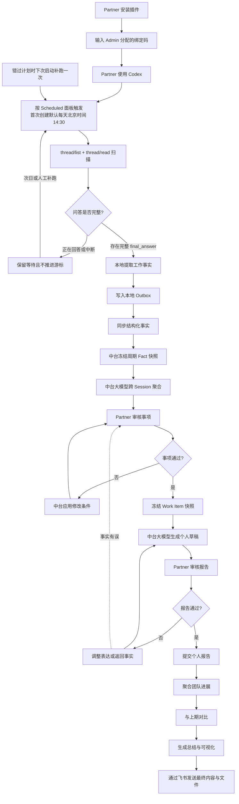

# Partner Report Agent 产品需求文档

> MVP 实现决策（2026-08-04）：Plugin 由无项目的独立 Codex Scheduled Task 在新聊天中调用；首次创建任务默认每天北京时间 14:30、`gpt-5.5` 和 `low` 推理，并通知所有运行，之后 Partner 可在 Scheduled 面板修改运行时间、模型、推理强度和通知策略。任务当前选择的模型直接逐 Session 提取，只处理包含用户问题和正常 `final_answer` 的 Complete Turn，并完成过滤、基础事实提取、项目目录识别和可靠上传；Plugin 不另行启动或配置模型，正常链路不使用每 Turn 生命周期 Hook 或高频 Runner。绑定成功即按文档中的采集范围默认启用，不设置独立上传授权步骤。Skill 仅在同名任务不存在时创建默认任务；安全契约升级时只修复 Prompt，已有任务的用户配置保持不变。跨 Session 聚合、工作卡片总结、审核修改、个人 Report 生成与重新生成统一由数据中台调用大模型完成。Partner 不登录数据中台，Team Admin 以唯一工作邮箱创建 Partner，并可为同一 Partner 分配多个绑定码。当前阶段不接入飞书和 Monitor，两轮审核由 Admin 在 Web 中代表 Partner 使用真实数据完成。

> 采集状态修订（2026-08-05）：首次运行只采集最近 1 天；后续按 Plugin 本地成功运行游标和 24 小时重叠窗口筛选候选 Session。已接收 Session 使用中台内容 hash 防重，被判定为 `ignore` 的 Session 使用本地匿名 hash 防重，跨运行租约阻止自动和手动采集并发。只有完整成功的 Run 才推进游标。所有 Session 提取指令以及上传的标题、摘要和贡献正文使用中文。任务级 automation memory 只保存安全运行摘要，不作为防重事实源。

> 采集终态审查修订（2026-08-05）：队列清空后 `collect-next` 只返回 `review_required`，独立的 `collect-review` 再核对队列和当前 Job；只有审查命令返回 `completed` 且 `checkpointAdvanced: true` 才能记录完整成功。所有携带 `nextCommand` 的状态都必须继续执行，不能因已运行时长或已处理部分 Session 提前收尾。

> 报告调度与归档修订（2026-08-05）：Team Admin 分别配置工作卡片聚合时间和 Team Report 生成时间。最后一张工作卡片完成审核后，中台自动冻结 Snapshot 并创建个人 Report 生成任务；Team Report 只在配置时间到达后，基于届时已锁定的个人 Report 版本生成，未提交人员显式列为缺席，不因全员提前提交而提前触发。报告归档同时保存工作卡片版本、个人 Report 版本及两者的明确引用关系。

## 1. 产品摘要

Partner Report Agent 是一个面向团队工作汇报的 Human-in-the-loop 系统。

系统在 Partner 自己的 Codex 环境中逐 Session 读取已授权的本地内容，过滤推理、命令和工具调用，在本地提取基础工作事实，并将不包含完整原始聊天的结构化事实同步到 Report Service。报告周期结束后，Report Service 按 Partner 和项目对多个 Session 的事实进行第二轮聚合，生成工作卡片并通过飞书发起第一轮审核；Partner 确认或修改后，Report Service 基于确认快照生成个人 Report 并发起第二轮审核。

到达 Team Admin 配置的 Team Report 生成时间后，系统基于届时已锁定的个人 Report 按项目聚合团队进展，保留无法归入公共项目的独立工作事项，显式列出未提交人员，并与上期 Report 比较，生成团队总结和可视化内容，最终通过飞书消息和文件附件发送给 Monitor。Monitor 仅作为最终团队报告的接收者，不参与报告审核、修改或追问流程。

产品核心原则：

> 报告不复述 Partner 聊了什么，而是说明工作状态发生了什么变化、产生了什么结果、有什么风险、下一步是什么，以及需要谁采取行动。

## 2. 背景与问题

### 2.1 当前问题

1. Partner 的有效工作信息分散在多个 Codex Session 中，人工回顾成本高。
2. Session 中包含大量探索、调试和重复讨论，直接摘要容易形成流水账。
3. AI 自动总结可能混淆“讨论”“计划”“进行中”和“完成”。
4. Partner 提交的个人报告格式、粒度和侧重点不一致，人工生成最终团队汇总成本高。
5. 只比较两期自然语言报告，难以准确识别新增、推进、完成和阻塞。
6. Partner 使用独立 Codex，飞书机器人和中心服务不能天然读取其聊天记录。
7. 原始 Codex 聊天可能包含代码、密钥、客户信息或其他敏感数据，不适合默认集中上传。

### 2.2 产品机会

在 Partner 本地完成逐 Session 事实提取，在服务端统一完成跨 Session 聚合、修改和报告生成，并通过飞书建立双层审核，可以同时满足：

- 降低 Partner 整理报告的时间成本。
- 提高报告事实准确性和可读性。
- 让 Partner 保持最终控制权。
- 让团队汇总和上期比较具备稳定的数据基础。
- 降低集中存储完整聊天记录带来的隐私风险。
- 让模型、系统 Prompt 和报告策略只在数据中台更新，减少 Plugin 升级频率。

## 3. 产品目标

### 3.1 MVP 目标

1. Team Admin 可以按唯一工作邮箱创建 Partner，并为同一 Partner 分配一个或多个 Plugin 绑定码。
2. 插件可以发现指定时间段内的本地 Codex Session，并报告数据覆盖率。
3. 插件在本地逐 Session 提取结构化基础事实，不执行跨 Session、周期级或 Report 级聚合。
4. Report Service 在周期结束后调用中台大模型，按 Partner 和项目聚合多个 Session 并生成工作卡片。
5. 当前阶段由 Admin 在 Web 中模拟 Partner，通过按钮和表单完成真实工作卡片审核与修改。
6. 工作事项通过后，Report Service 调用中台大模型生成个人 Report 草稿并进行第二轮审核。
7. 只有 Web 第二轮确认并锁定的个人 Report 才视为完成。
8. 所有报告结论可以追溯到 Session 事实或审核时补充的事实。

### 3.2 成功标准

- Partner 完成一份周报的中位审核时间不超过 10 分钟。
- 试点期 Partner 周报按时提交率达到 90% 以上。
- 工作事项中 100% 的事实性结论具备来源或标记为 Partner 补充。
- 80% 以上的 Partner 修改可在飞书审核闭环中完成。
- 最终团队报告可以按配置时间成功发送到 Monitor 的飞书会话，并支持打开或下载报告附件。
- 不发生跨 Partner、跨团队的数据越权。

### 3.3 非目标

MVP 不包含：

- 个人绩效评分、排名或基于消息数量衡量贡献。
- 自动提交未经 Partner 审核的个人 Report。
- 默认上传完整 Codex 原始聊天记录。
- Monitor 审核、修改、追问或重新生成团队报告。
- Monitor 下钻查看个人 Report、工作事实、证据摘要或 Partner 提交进度。
- 支持所有外部聊天平台。
- 飞书卡片审核、飞书消息通知、Monitor 交付和团队 Report 聚合；这些属于后续阶段。
- 对 Codex 云端、其他设备或关闭历史记录后的 Session 作完整性保证。
- 高自由度的 BI 仪表盘和自定义报表设计器。

## 4. 用户与角色

### 4.1 Partner

团队成员。拥有以下权限：

- 安装本地 Codex Plugin，并输入 Team Admin 分配的绑定码。
- 选择可用于报告的项目、Session 和时间范围。
- 查看并审核自己的工作事项。
- 查看有限的证据摘要。
- 补充、修正、排除、合并工作事项。
- 调整本期侧重点和长期表达偏好。
- 审核并提交个人 Report。
- 请求 Admin 停用 Plugin 绑定码或删除自己的同步数据。

### 4.2 Monitor

最终团队报告接收者。仅需：

- 在指定飞书单聊或群聊中接收最终团队报告消息。
- 查看消息正文中的团队总结和可视化摘要。
- 打开或下载随消息发送的最终报告文件。

Monitor 不安装 Codex Plugin，不需要登录 Report Service，不承担任何配置、审核或反馈操作，也不能通过本产品访问个人 Report、原始 Session 或证据摘要。

### 4.3 Team Admin

负责组织配置和权限管理：

- 配置团队、Partner、Monitor 和项目映射。
- 以唯一工作邮箱创建 Partner，并为每个 Partner 生成、停用和查看多个 Plugin 绑定码。
- 配置报告周期、截止时间、模板和通知策略。
- 管理飞书应用可用范围。
- 管理数据保留、安全策略和插件分发策略。
- 查看同步状态和审计记录，但不默认查看原始证据。

### 4.4 Report Agent

系统代理，负责：

- 在 Plugin 本地完成逐 Session 事实提取。
- 在数据中台完成跨 Session 工作事项识别、去重和时间线重建。
- 重要性排序。
- 在数据中台完成修改意图解析。
- 在数据中台完成个人和团队报告生成。
- 上期比较、质量检查、提醒和交付。

## 5. 关键术语

| 术语                | 定义                                                                                                |
| ------------------- | --------------------------------------------------------------------------------------------------- |
| Session             | Partner 与 Codex Agent 的一次独立对话线程                                                           |
| Complete Turn       | 同一 Turn 中同时存在用户问题和正常完成的 Assistant 最终回复；中断、取消、报错或只有过程输出不算完整 |
| Session Work Fact   | 从一个 Session 中提取的结构化工作事实                                                               |
| Work Item           | 跨一个或多个 Session 聚合出的稳定工作事项                                                           |
| Binding Code        | Admin 分配给某个 Partner 的长期 Plugin 接入码；一个 Partner 可有多个                                |
| Project Root        | Admin 配置的项目根目录；该目录及其任意层级子目录属于同一项目                                        |
| Evidence            | 支撑事实结论的 Session、时间、消息摘要或 Partner 补充记录                                           |
| Individual Report   | 经 Partner 确认的个人周报或月报                                                                     |
| Team Report         | 基于已提交个人 Report 生成的团队报告                                                                |
| Review Cycle        | 一次工作事项审核或 Report 审核循环                                                                  |
| Re-analysis Request | 服务端要求本地插件重新读取 Session 的请求                                                           |
| Coverage            | 指定周期内可发现、可读取、成功分析的 Session 覆盖情况                                               |

## 6. 已知平台能力与约束

本节记录 2026-07-31 验证过的能力。进入开发前应再次核对平台版本。

### 6.1 Codex

1. Codex Plugin 可以打包 Skill、MCP Server 和生命周期 Hook。
2. `Stop` Hook 在一个 Agent Turn 停止时触发，可以获得 `session_id`、`turn_id`、`transcript_path` 和最后一条 Assistant 消息，适合把 Session 标记为有新增内容。
3. `SessionEnd` Hook 可以获得 `session_id` 和 `transcript_path`，但只对主线程生效，不对 Subagent 生效。
4. `SessionEnd` 在对话被归档或删除、Codex 正常关闭，或对话空闲且没有客户端保持打开约 30 分钟后触发；切换到其他对话不会立即触发。
5. 当前 `SessionEnd.reason` 统一为 `other`，不能区分归档、关闭或空闲。
6. 一个 Session 在 `SessionEnd` 后仍可能恢复并产生新 Turn，因此 `SessionEnd` 只能视为阶段性汇总信号。
7. `SessionEnd` Hook 最长执行时间较短，当前不适合直接执行完整 LLM 分析。
8. Hook 中的 transcript 文件格式不是稳定接口，不应作为长期解析协议。
9. Codex App Server 提供 `thread/list` 和 `thread/read(includeTurns)` 等线程读取能力，适合作为本地集成边界。
10. Codex 桌面端 Scheduled Tasks 可以在本地项目中调用 Skill 和 Plugin。
11. 本地 Scheduled Task 依赖电脑开机、Codex 桌面应用运行以及适当的文件和网络权限。
12. Codex CLI 和 IDE 当前不是 Scheduled Tasks 的管理入口。
13. Partner 关闭历史记录、删除 Session、使用多个设备或云端 Session 时，可能出现覆盖缺口。
14. 本产品正常采集链路不使用每 Turn 的 `Stop`/`SessionEnd` Hook，而使用 Codex Scheduled Task 按面板配置触发结构化扫描（首次创建默认每天北京时间 14:30）；生命周期 Hook 仅作为已知平台能力保留，不是 MVP 依赖。

官方参考：

- [Codex Plugins](https://learn.chatgpt.com/docs/build-plugins)
- [Codex Hooks](https://learn.chatgpt.com/docs/hooks)
- [Codex Scheduled Tasks](https://learn.chatgpt.com/docs/automations)
- [Codex App Server](https://learn.chatgpt.com/docs/app-server)

### 6.2 飞书

1. 飞书新版卡片 JSON 2.0 支持标题、富文本、标签、分栏、按钮、下拉选择、输入框、表单、日期选择、折叠面板和表格等组件。
2. Partner 操作卡片后，飞书可以向开发者服务端发送回调。
3. 服务端可以基于回调更新整张卡片或局部组件。
4. 复杂、耗时的 LLM 处理不应阻塞卡片回调，应先快速确认接收，再异步更新卡片。
5. 卡片适合通知、单项审核和简单修改，不适合大量事项的复杂批量编辑。

官方参考：

- [飞书新版卡片搭建工具](https://open.feishu.cn/document/uAjLw4CM/ukzMukzMukzM/feishu-cards/feishu-card-cardkit/feishu-cardkit-overview?from=botpush)
- [飞书卡片输入框与表单](https://open.feishu.cn/document/feishu-cards/card-json-v2-components/interactive-components/input)
- [飞书卡片交互回调](https://open.feishu.cn/document/uAjLw4CM/ukzMukzMukzM/feishu-cards/handle-card-callbacks?lang=zh-CN)
- [飞书卡片局部更新](https://open.feishu.cn/document/cardkit-v1/streaming-updates-openapi-overview?lang=zh-CN)

## 7. 产品范围与核心决策

### 7.1 MVP 支持范围

- 报告类型：周报优先，数据模型兼容月报。
- 默认数据周期：上周五 13:00 至本周五 13:00，按 Team 时区配置；本周五 13:00 后完成的 Turn 进入下一周期。
- Codex 客户端：macOS Codex 桌面端。
- 设备范围：一个 Partner 可以使用一个或多个 Plugin Instance；每个实例使用独立绑定码。
- Codex 来源：当前设备、本地 `CODEX_HOME` 中保存的 Session。
- 后续范围：CLI、IDE 和云端 Session 不进入 MVP 完整性承诺；多 Plugin 数据可以归并到同一 Partner，但跨设备 Coverage 完整性不作保证。
- 飞书来源（后续阶段）：企业自建应用机器人；当前实现不接入。
- 当前审核方式：Admin Web 代表 Partner 完成两轮真实数据审核；飞书卡片与自然语言审核留待后续。
- 当前审核输出：Admin Web 模拟 Partner 两轮审核，数据来自真实 Fact 和不可变 Snapshot；Partner 不登录数据中台。
- 后续审核与交付：飞书卡片和 Monitor 最终消息不进入当前 MVP 实现。
- 原始聊天：默认只在 Partner 本地处理。
- 中心服务：保存结构化 Session Work Facts、Work Items、报告版本和有限证据摘要。
- AI 执行边界：逐 Session 基础事实提取在 Plugin 本地执行；跨 Session 聚合、工作卡片总结、修改意图解析和 Report 生成在数据中台执行。
- Prompt 管理：中台 Prompt、模型和生成策略集中版本化管理；兼容 Schema 下的 Prompt 更新不要求 Partner 升级 Plugin。
- 身份绑定：Partner 不登录 Report Service；Admin 以唯一工作邮箱创建 Partner，并可为同一 Partner 创建多个长期绑定码。
- 项目识别：Plugin 使用 Session 工作目录与项目根目录做边界安全的祖先目录匹配；子目录归属同一项目，多重匹配时选择最长、最具体的项目根目录。

### 7.2 数据同步策略

采用“按 Scheduled 面板触发、按成功运行游标筛选候选 Session、按完整 Session 内容 hash 生成修订、周期结束后中台聚合”。正常链路不依赖每个 Turn 的 `Stop` Hook、`SessionEnd` Hook、2 小时静默窗口、每 5 分钟 Runner 或每 6 小时补偿扫描。

默认采集规则：

1. Plugin 按 Codex Scheduled 面板配置触发 Daily Collection Run，首次创建任务默认每天北京时间 14:30。
2. 每个报告数据窗口为“上一次周五 13:00 至本次周五 13:00”；13:00 之后完成的 Turn 进入下一个窗口。
3. 第一次运行把采集下界固化为“运行开始前 1 天”和报告周期开始时间中的较晚者；后续周期不得回溯到该下界之前。
4. 后续运行使用上次完整成功 Run 的开始时间作为候选游标，并向前重叠 24 小时；失败或中断不得推进游标。
5. Daily Collection Run 通过 Codex App Server `thread/list` 按 `updatedAt` 筛选候选 Session，再用 `thread/read(includeTurns)` 读取结构化 Turn。
6. 候选 Session 使用当前采集范围内的全部完整 Turn 重新计算内容 hash；中台已接收且 hash 未变化时不调用模型。
7. 模型判定为 `ignore` 时，只在本地保存匿名 Session key 与内容 hash；后续未变化时不再调用模型，也不上传忽略记录。
8. 跨运行租约阻止自动任务和手动任务并发提取；过期租约可以在安全超时后被新运行接管。
9. 正在回答、被中断或没有正常 `final_answer` 的 Turn 不进入模型输入；后续正常完成并改变 Session hash 后重新判断。
10. 提取 Prompt 使用中文，上传的标题、摘要和贡献正文必须通过中文校验。
11. Daily Collection Run 开始和结束时各发送一次状态，Admin 通过最后计划时间、最后成功时间、Session/Fact 数量和错误查看 Plugin 是否正常。
12. 同一 Plugin Instance、报告窗口和输入快照使用稳定幂等键，重复上传不得重复创建 Fact。
13. Session Contribution 提取完成后立即上传；数据中台在本周期截止时间直接冻结 Partner Fact Snapshot，不设置采集宽限期。

Plugin 本地保存的采集状态：

```text
plugin_instance_id
+ collection_floor_at
+ last_successful_run_started_at
+ ignored_session_anonymous_key -> content_hash + processed_at
+ active_run_lease
```

同一 Session 恢复或新增完整 Turn 后，Plugin 重建采集范围内的完整 Session Contribution；内容 hash 变化时上传新的当前修订。跨 Session 的 Work Item 状态链由数据中台在周期聚合时重建。

Turn 只有同时满足以下条件才进入提取：

- 存在非空用户问题。
- 存在非空且正常完成的 Assistant `final_answer`。
- Turn 未被标记为中断、取消或失败。

如果用户已提问但模型输出中途被中断，Plugin 不把该 Turn 放入 Session 提取输入。若该 Turn 后续恢复并产生完整最终回复，Session 的更新时间和内容 hash 变化，下一次扫描会重新判断。Session 中更早已经完整的 Turn 仍可正常处理。

原因：

- 降低一次性处理的 Token 和时间成本。
- 减少 Session 删除或历史关闭造成的数据丢失。
- 修改时间范围时可以直接重用已同步事实。
- 支持失败重试和覆盖率监控。
- 避免每个 Turn 触发 Hook 和频繁后台扫描。
- 通过候选运行游标、重叠窗口和完整 Session 内容 hash，在低频运行下仍能提取更新。
- 周期结束时中台只需聚合结构化 Fact，不必重新读取全部聊天。

### 7.3 Re-analysis 交付策略

Report Service 不假设可以主动唤醒 Partner 设备上的 Codex Plugin。

- 服务端把 Re-analysis Request 写入待领取队列。
- 正常链路不高频轮询待处理请求；Re-analysis 由 Partner 或 Admin 明确发起后，在 Plugin 中人工立即执行，或由下一次 Daily Collection Run 领取。
- Partner 可以从飞书点击“立即重新同步”，并按提示在本地启动一次 Re-analysis；该操作不改变每天一次的正常采集计划。
- Plugin 离线时，飞书必须显示“等待本地 Codex”，不得显示处理完成。
- 请求支持超时、取消、幂等和重复领取保护。

### 7.4 Plugin 与数据中台职责边界

Plugin 负责：

- 发现本机 Session，维护本地运行游标、ignore hash 和跨运行租约。
- 逐 Session 读取采集范围内的完整 Turn，只把包含用户问题和正常完成 `final_answer` 的问答送入提取。
- 在单个 Session 内提取基础 Fact、有限去重、脱敏和 Schema 校验。
- 根据 Admin 下发的项目根目录识别 `project_id`，上传相对目录和匹配方式。
- 可靠上传、失败重试、Daily Collection Run 状态与 Coverage 上报，以及执行必须读取原始 Session 的 Re-analysis Request。

数据中台负责：

- 通过 Binding Code 识别 Plugin，并将数据归属到工作邮箱对应的内部 `partner_id`。
- 保存 Fact 修订、来源关系、项目归属、Coverage 和生成审计。
- 在周期截止后冻结 Fact Snapshot，调用中台大模型完成跨 Session、按项目的第二轮聚合。
- 生成工作卡片，执行确定性审核操作，并用中台大模型解析需要语义处理的修改。
- 在第一轮确认后冻结 Work Item Snapshot，调用中台大模型生成或重新生成 Individual Report。

除 Re-analysis 外，Plugin 不领取或执行 `AGGREGATE_WORK_ITEMS`、`GENERATE_INDIVIDUAL_REPORT`、`REGENERATE_INDIVIDUAL_REPORT` 等中台 AI 任务。

### 7.5 隐私策略

采用混合模式：

- 完整原始 Session 默认留在 Partner 本地。
- 上传中文结构化工作事实、匿名 Session key、时间和项目身份；不上传原始对话或原始 Session 标识。
- 绑定成功即默认启用既定采集范围，不增加单独的上传授权或授权状态校验步骤。
- 如果服务端已有足够事实，修改在服务端重新聚合。
- 如果必须重新深挖原始聊天，创建 Re-analysis Request，由本地插件领取并执行。
- Partner 可以选择对特定 Session 完全排除，或授权上传更详细证据。

## 8. 端到端工作流



## 9. 用户流程

### 9.1 Partner 首次安装与绑定

1. Team Admin 使用唯一工作邮箱创建 Partner；邮箱标准化后全局唯一，内部生成稳定 `partner_id`，后续邮箱展示信息变化不改变数据主键。
2. Team Admin 为该 Partner 创建一个或多个长期 Binding Code；每个 Code 代表一个独立 Plugin Instance，可设置设备名称并由 Admin 停用。
3. Team Admin 分发 GitHub Marketplace 稳定版本入口和对应 Binding Code；Partner 不需要登录 Report Service。
4. Partner 安装并启用 Plugin；绑定成功后 Skill 在同名任务不存在时创建独立 Scheduled Task，默认每天北京时间 14:30、运行于新聊天且项目为无；已有任务保留 Partner 在面板中的配置，正常链路不安装每 Turn 触发的生命周期 Hook。
5. Partner 在 Plugin 连接流程中输入 Binding Code 和设备名称。
6. Report Service 根据 Binding Code 建立以下绑定：

```text
tenant_id
  + partner_id
  + normalized_work_email
  + binding_code_id
  + plugin_instance_id
  + device_name
```

7. 同一工作邮箱可以拥有多个 Binding Code 和 Plugin Instance；所有实例上传的数据最终归属同一个 `partner_id`，Admin 仍可按 Binding Code 查看各实例状态。
8. Partner 配置：
   - 确认当前使用 macOS Codex 桌面端。
   - 确认本地 Session 历史记录已启用。
   - 默认报告周期。
   - 从中台获取允许或排除的项目根目录。
   - 是否上传有限证据摘要。
   - 首次默认的北京时区和每天 14:30 采集计划；之后以 Scheduled 面板为准。
   - 是否允许访问 Report Service 网络域名。
9. 系统执行一次只读预检，展示可发现 Session 数量，不立即上传完整数据。
10. 系统执行一次测试同步，展示读取、排除、失败和待处理数量。
11. 测试同步成功后确认 Daily Collection Task 已启用；后续 Marketplace 兼容升级复用同一 `PLUGIN_DATA`、Binding Code 和 Plugin Instance，不重复绑定。

### 9.2 每日 Session 发现与本地提取

1. Codex Scheduled Task 按面板配置在新聊天中启动 Daily Collection Run（首次创建默认每天北京时间 14:30），不在每个 Agent Turn 结束时运行 Hook。
2. Plugin 先取得本地采集租约；若自动或手动 Run 已持有有效租约，则当前 Run 返回 `COLLECTION_ALREADY_RUNNING`，不并发提取。
3. Plugin 读取本地 `collection-state.json`。没有成功历史时固化最近 1 天采集下界；有成功历史时从上次成功 Run 开始时间向前重叠 24 小时。
4. Plugin 向中台发送“本次采集开始”状态，通过 Codex App Server `thread/list` 按更新时间筛选候选 Session，再调用 `thread/read(includeTurns)`。
5. 每个候选 Session 只保留采集范围内完整的“用户问题 + Assistant `final_answer`”组合；中断、取消、失败或缺少最终回复的 Turn 不进入模型输入。
6. Plugin 重建候选 Session 在采集范围内的完整内容并计算匿名 Session key 和内容 hash。中台已接收且 hash 未变化时直接跳过。
7. 本地 ignore 状态中 hash 未变化时直接跳过；变化后重新调用模型判断。
8. 规范化 Session 工作目录，并在配置的项目根目录中执行祖先目录匹配；同时匹配多个项目时选择最长根目录。
9. 当前定时任务模型逐 Session 判断项目价值并生成中文标题、摘要和贡献正文；不得在 Plugin 中执行跨 Session 或周期级聚合。
10. 本地完成敏感信息、中文字段、不可变字段和 Schema 校验。
11. `ignore` 结果只保存本地匿名 hash，不上传；`include` 结果通过 HTTPS API 立即上传，并携带稳定幂等键。
12. 只有全部候选 Session 处理完成且中台接收“本次采集完成”状态后，Plugin 才把本次 Run 开始时间写入成功游标并释放租约。
13. 失败或中断不推进成功游标；下一次 Run 重新覆盖该范围，已上传和已忽略且 hash 未变化的 Session仍会被跳过。
14. automation memory 只记录运行时间、状态、聚合计数和安全错误码；Plugin 本地状态和中台状态是防重事实源。
15. Plugin 上报扫描、窗口外、提取、缓存跳过、上传和失败数量；设备不可用时等待下一次 Scheduled Run，不启动常驻 Runner。

### 9.3 工作事项审核

1. 周报周期截止时，Report Service 按 `tenant_id + partner_id + period_id` 直接冻结 Session Contribution Snapshot；来自同一 Partner 多个 Binding Code 的数据进入同一快照。
2. 中台优先按明确 `project_id` 分组，再调用中台大模型按工作事项、项目和时间进行跨 Session 聚类、去重和状态重建。
3. 中台生成 Work Item Draft，并按重要性排序；每个结论必须保留源 `fact_id`。
4. 飞书机器人发送审核总览卡。
5. Partner 逐项确认、修改、排除或查看证据。
6. 标题、状态、排除、重点和明确项目调整等确定性修改由中台规则直接处理；合并、拆分和自然语言重写等语义修改由中台大模型生成受限结构化操作。
7. 每次修改先生成结构化 Change Preview。
8. Partner 确认 Change Preview 后才应用修改。
9. 所有工作事项确认后，生成不可变的 Work Item Snapshot。

### 9.4 个人 Report 审核

1. 数据中台调用统一模型服务，基于已确认 Work Item Snapshot 生成个人 Report 草稿；Plugin 不参与 Report 生成。
2. 飞书机器人发送 Report 审核卡。
3. Partner 可以调整结构、侧重点、长度和语言风格。
4. 表达修改由数据中台根据修改条件和已确认事实重新生成 Report。
5. 如果 Partner 指出事实错误，必须返回工作事项层修正。
6. Partner 确认后生成不可变的 Individual Report Snapshot。
7. 个人 Report 状态变为 `SUBMITTED`。

### 9.5 团队聚合

1. 到达团队截止时间后，系统检查提交状态。
2. 未提交人员单独标记，不使用未确认草稿替代。
3. 系统仅使用 `SUBMITTED` 的结构化个人报告进行聚合。
4. 优先使用明确 `project_id` 合并工作事项。
5. 无明确 ID 时使用项目别名和语义匹配。
6. 低置信度项目归属保持独立，不强制聚合。
7. 无公共项目归属的内容进入“独立工作”区域。
8. 系统重建团队项目状态、成果、风险、依赖和下一步。

### 9.6 与上期比较

比较优先级：

1. 相同 `work_item_id`。
2. 相同外部任务 ID、Issue ID 或 PR ID。
3. 同一 `project_id` 下的高置信度语义匹配。
4. 无法匹配则视为新增，或标记待确认。

变化类型：

- 本期新增。
- 持续推进。
- 已完成。
- 新增阻塞。
- 阻塞解除。
- 连续无更新。
- 目标或范围变化。
- 延期或里程碑变化。

系统不得在没有明确来源的情况下生成虚构完成百分比。

### 9.7 Monitor 最终报告交付

1. 到达 Team Admin 配置的生成时间后，使用届时已锁定的个人 Report 完成团队聚合、上期对比和最终渲染，生成不可变的 Team Report 版本；未提交人员必须显式列出。
2. 飞书机器人向 Team Admin 配置的 Monitor 单聊或群聊发送一条最终报告消息。
3. 消息正文展示报告周期、团队摘要、关键成果、项目进展变化、风险与阻塞、下一步和需要关注的事项。
4. 同一条交付消息附带最终团队报告文件；MVP 至少支持 PDF，文件内容与消息中标识的 Team Report 版本一致。
5. Monitor 只接收、阅读或下载最终内容，消息不提供审核、修改、重新生成、下钻或追问入口，也不要求 Monitor 回复。
6. 接收位置、发送时间、报告模板和文件格式由 Team Admin 统一配置，不由 Monitor 设置。
7. 消息或文件发送失败时，系统自动重试并记录交付状态；同一报告版本不得重复发送多条成功消息。

### 9.8 Partner 首次设置清单

Partner 设置采用四步向导：

```text
输入绑定码 -> 同步测试 -> 完成
```

必须设置：

1. 安装并启用团队 Report Plugin。
2. 输入 Team Admin 分配的 Binding Code 和设备名称；不需要登录 Report Service。
3. 确认本地 Session 历史记录未关闭。
4. 选择允许分析和必须排除的项目目录。
5. 选择是否允许上传有限 Evidence Excerpt。
6. 确认 Skill 已创建默认每天北京时间 14:30、运行于新聊天、项目为无、模型为 `gpt-5.5`、推理强度为 `low`、通知所有运行的 Daily Collection Task；这些值可在 Scheduled 面板修改，并授权访问 Report Service 网络域名。
7. 完成一次测试同步，确认 Session 覆盖和错误提示。

可选设置：

- 报告语言、长度和技术细节程度。
- 默认按项目或目标组织。
- 长期侧重点，例如优先展示成果、影响或风险。
- 自定义敏感关键词和项目排除规则。

MVP 运行条件：

- 使用 macOS Codex 桌面端。
- 每台设备使用独立 Binding Code；多个设备可以归属同一工作邮箱对应的 Partner。
- 定时执行时设备开机且 Codex 桌面应用运行。
- 多设备之间若存在重复 Session，由服务端基于 Session 标识、来源修订和内容 Hash 去重。

### 9.9 Monitor 使用要求

Monitor 端零安装、零配置、零审核：

1. 不安装 Codex Plugin。
2. 不需要登录 Report Service，也不需要访问 Partner 的 Session。
3. 不需要绑定或配置报告周期、模板、发送时间和显示视图。
4. 只需能够在飞书中接收机器人消息并打开或下载附件。
5. 不通过 Report Agent 发起修改、追问或事实确认。

Monitor 的飞书身份或接收群、消息发送时间和报告模板均由 Team Admin 预先配置。

### 9.10 Team Admin 设置清单

1. 创建并发布飞书企业自建应用。
2. 配置机器人可用范围、卡片回调、事件权限、消息权限、文件上传与发送权限和接收地址。
3. 使用唯一工作邮箱创建 Partner，为每个 Partner 创建一个或多个 Binding Code，并查看每个 Code 对应 Plugin 的设备、上次计划运行、上次成功同步、Fact 数量和错误状态。
4. 维护 Partner 的飞书审核接收目标，以及 Monitor 接收目标的 `open_id` 或 `chat_id`；飞书身份不参与 Plugin 绑定。
5. 维护项目 ID、项目根目录、排除目录、项目别名和独立工作分类规则。
6. 配置 Report Plugin 私有分发渠道和最低版本。
7. 配置 Report Service 域名和网络允许规则。
8. 配置报告模板、周期、时区、截止时间和提醒策略。
9. 配置数据保留、删除、离职处理和审计策略。
10. 配置 Monitor 的飞书单聊或群聊接收目标，以及最终报告的发送时间和附件格式。

## 10. 功能需求

### FR-01 插件安装与绑定码身份识别

优先级：P0

- 插件必须包含唯一名称、版本和更新机制。
- 插件必须可由 GitHub Marketplace 稳定 Release 通过 Codex 官方途径安装和升级；生产入口不得直接跟随未验证的 `main`。
- Plugin 代码版本与本地配置必须分离；兼容升级不得要求重新输入 Binding Code 或重新配置项目。
- 本地 `collection-state.json` 必须包含 Schema 版本、Plugin Instance 归属并使用 `0600` 原子写入；Daily Collection Task 的计划、最近运行状态和升级变化必须在发布说明及 Admin 状态中明确展示。
- Plugin 必须提供可由 Codex Scheduled Task 稳定调用的 `collect-start` 入口；绑定成功后 Skill 必须通过 Codex 官方能力在同名任务不存在时自动创建默认任务，存在时保留用户的调度和模型配置，并在安全契约升级时只修复中文 Prompt。Prompt 必须声明首次 1 天边界、增量防重和 automation memory 最小化规则。正常链路不得要求 Partner 信任每 Turn 触发的 `Stop` 或 `SessionEnd` Hook。
- Admin 必须以标准化后的唯一工作邮箱创建 Partner；服务端使用稳定内部 `partner_id` 作为数据关联键，不直接使用邮箱作为外键。
- Admin 必须可以为同一个 Partner 创建多个 Binding Code；每个 Code 对应一个独立 Plugin Instance 和设备来源。
- Admin 页面必须完整展示新生成的 Binding Code，并提供一键复制；关闭生成弹窗后仍可在对应 Partner 下查看和复制。Binding Code 不得通过 Partner、Plugin 或公开接口返回。
- Partner 不需要登录 Report Service；Plugin 输入 Binding Code 后即可建立 `binding_code_id -> plugin_instance_id -> partner_id` 关系。
- Plugin 上传时不得自行指定可信 `partner_id`；服务端必须根据 Binding Code 对应的实例推导 Tenant、Team 和 Partner 归属。
- Binding Code 用于首次绑定一个 Plugin Instance，认领后由实例 Token 持续访问；同一 Partner 可生成多个 Code，Admin 可在认领前停用 Code，并可在认领后停用对应 Plugin Instance。
- Admin 必须能够按 Binding Code 查看设备名称、Plugin 版本、上次计划时间、上次开始/完成时间、最后同步、Session/Fact 数量、最近错误和状态。
- 服务端必须立即停止接收已停用 Binding Code 或 Plugin Instance 的数据。

### FR-02 Session 发现与覆盖率

优先级：P0

- 支持按创建或更新时间筛选 Session。
- 支持按项目目录和显式排除规则过滤。
- 支持发现活跃和已归档本地 Session。
- Plugin 必须按 Codex Scheduled 面板配置运行 Daily Collection Run，首次创建默认每天北京时间 14:30；正常情况下不在计划外自动扫描。
- 第一次 Run 只处理最近 1 天；后续 Run 必须使用成功运行游标和 24 小时重叠窗口，通过 `thread/list` 和 `thread/read(includeTurns)` 发现候选 Session。
- Plugin 必须比较中台已接收内容 hash 和本地 ignore 内容 hash；未变化时不得重复调用模型。
- 扫描时正在回答的 Turn 必须从模型输入中排除；同一 Session 中更早的 Complete Turn 仍应正常提取。
- 计划运行错过时，下一次 Scheduled Task 按成功运行游标增量采集；不得恢复每 5 分钟或每 6 小时的常驻扫描。
- 每次 Daily Collection Run 必须向中台上报计划时间、开始时间、完成时间、扫描数、Complete Turn 数、等待中 Turn 数、上传数和错误。
- Session Contribution 必须在提取并校验通过后立即上传；数据中台在周期截止时直接冻结 Snapshot，不设置额外宽限期。
- 同一 Session 恢复后必须重建采集范围内的完整内容；只有内容 hash 变化时才重新分析并生成修订。
- 自动和手动采集必须共享本地状态与租约，不能并发调用模型。
- Session 提取 Prompt 及上传的标题、摘要和贡献正文必须使用中文。
- 只有同时包含用户问题和正常完成 Assistant `final_answer` 的 Turn 才能进入提取；中断、取消、失败或只有过程输出的 Turn 不得进入事实提取，保留等待状态供后续扫描重新判断。
- 支持幂等同步，不能重复创建同一 Session 事实。
- 每个周期展示：发现数、成功读取数、成功提取数、不完整 Turn 等待数、失败数、被排除数。
- 如果 Partner 关闭历史、Session 删除或设备离线，必须显示覆盖不足，不能静默忽略。

### FR-03 Session 事实提取

优先级：P0

每个 Session 至少提取：

- 工作相关性。
- 项目或主题。
- Work Item 候选名称。
- Actions：做了什么。
- Outcomes：产出了什么结果。
- Impact：为什么重要。
- Status：当前状态。
- Status Change：发生了什么变化。
- Decisions：关键决策。
- Blockers：阻塞及影响。
- Next Steps：下一步。
- Evidence：来源时间和有限摘要。
- Confidence：提取置信度。
- Sensitivity Flags：敏感信息标记。

提取输入只能包含 Complete Turn：

- 一个非空用户问题。
- 一个非空且正常完成的 Assistant `final_answer`。
- 明确的 `turn_id`、完成时间和来源边界。

不得将被中断的 Assistant 片段、commentary、reasoning 或工具输出拼接成最终回复；计划时间到达、人工补跑或报告截止本身也不能把不完整 Turn 变成 Complete Turn。

每次上传还必须携带：

- `plugin_instance_id` 或等价的可信来源实例标识。
- Session 工作目录对应的 `project_id`。
- 项目根目录指纹和 Session 相对目录；默认不要求中心保存包含本机用户名的完整绝对路径。
- 项目匹配方法，例如 `exact_root`、`descendant_path` 或 `unassigned`。
- `source_revision`、`source_hash` 和 Turn 范围。

必须区分：

- 讨论或探索。
- 计划执行。
- 正在执行。
- 等待验证。
- 已完成。
- 被阻塞。
- 已取消。

Plugin 只允许在单个 Session 内做基础事实提取和有限去重，不得在本地完成跨 Session 工作事项聚合、周期总结或个人 Report 生成。

### FR-03A 项目目录识别

优先级：P0

- Team Admin 为项目配置一个或多个 Project Root，并可配置排除目录；Project Root 可以按 Binding Code/Plugin Instance 配置，使同一项目在不同设备上的不同绝对路径映射到同一 `project_id`。
- Plugin 在本地规范化 Project Root 和 Session 工作目录，处理路径分隔符、`.`、`..` 和符号链接后再匹配。
- 当 `session_cwd == project_root` 时，Session 归属该项目。
- 当 `session_cwd` 是 `project_root` 的任意层级子目录时，Session 仍归属该项目。
- 路径匹配必须使用目录边界；`/projects/crm-v2` 不得误匹配 `/projects/crm`。
- 同时命中多个 Project Root 时，选择最长、最具体的根目录。
- 没有目录匹配时上传为未分配，不得仅为提高聚合率而强行猜测项目。
- Partner 在第一轮审核中修正项目后，中台可以更新项目映射规则供后续 Plugin 同步使用。

### FR-04 工作事项聚合

优先级：P0

- 聚合必须由数据中台在周期结束后调用统一模型服务执行，不依赖 Partner 设备在线。
- 按 `tenant_id + partner_id + period_id` 汇总 Fact；同一 Partner 下多个 Binding Code 的数据必须进入同一聚合输入。
- 优先按可信 `project_id` 分组，再跨 Session 识别同一工作事项。
- 去除重复讨论和重复状态。
- 保留重要决策和状态变化。
- 按项目聚合，时间顺序用于重建过程。
- 生成稳定 `work_item_id`。
- 不确定合并必须保留置信度并允许 Partner 拆分。
- 独立工作不得为提高聚合率而强行归入项目。
- 每次聚合必须记录模型版本、Prompt 名称和版本、输入快照 Checksum、输出 Schema 版本和执行状态。

### FR-05 重要性排序

优先级：P0

重要性综合考虑：

- 是否产生明确成果。
- 是否推动状态或里程碑变化。
- 是否具有业务或工程影响。
- 是否包含关键决策。
- 是否存在风险和阻塞。
- 是否需要 Monitor 采取行动。
- 是否被 Partner 明确标记为重点。
- 是否为重复信息。

建议内部评分：

```text
importance_score =
  outcome_score
  + impact_score
  + status_change_score
  + decision_score
  + blocker_score
  + monitor_action_score
  + partner_emphasis_score
  - repetition_penalty
```

评分只用于排序，不直接展示为个人绩效分数。

### FR-06 工作事项审核

优先级：P0

Partner 必须能够：

- 确认事项。
- 修改事实。
- 补充事实。
- 排除事项。
- 恢复被排除事项。
- 设置或取消重点。
- 调整项目归属。
- 调整状态。
- 合并或拆分事项。
- 查看证据摘要。
- 修改时间范围。
- 添加完全遗漏的事项。

所有变更必须：

- 有操作者、时间和版本记录。
- 在应用前展示 Change Preview。
- 区分 AI 提取事实与 Partner 补充事实。
- 使用乐观锁防止旧卡片覆盖新版本。
- 确定性修改由中台规则执行；需要语义理解的修改由中台模型返回受限操作，不允许模型直接写数据库。

### FR-07 Re-analysis Request

优先级：P0

以下修改必须触发本地重新分析：

- 时间范围扩大到尚未同步的 Session。
- Partner 要求从原始聊天中深挖新的主题。
- 现有证据不足以支持事实修正。
- 提取器版本升级且需要重新生成事实。

服务端创建请求后：

- 正常链路不高频轮询。Partner 或 Admin 明确发起后，Partner 在 Plugin 中立即执行 Re-analysis；未人工执行的请求由下一次 Daily Collection Run 领取。
- 普通每日链路不要求 Partner 手动运行 Skill；只有希望在次日计划时间前补提时才需要人工立即执行。
- 飞书卡片显示“等待本地 Codex 重新分析”。
- Plugin 离线时不得假装修改已完成。
- 请求需要超时、取消和重试能力。
- 请求必须支持幂等领取和租约超时，避免多设备、人工执行和每日任务重复处理。
- MVP 不提供服务端直接唤醒本地 Plugin 的能力。

### FR-08 个人 Report 生成与审核

优先级：P0

- Individual Report 的生成、重新生成和表达修改必须由数据中台统一调用模型服务完成，不得下发给 Plugin 执行。
- Report 只能读取已确认的 Work Item Snapshot、Coverage、模板和 Partner 偏好。

默认结构：

1. 本期摘要。
2. 关键成果。
3. 按项目组织的工作事项进展。
4. 风险与阻塞。
5. 下一期重点。
6. 需要 Monitor 协调或决策的事项。
7. 数据覆盖提示。

Partner 可以修改：

- 长度。
- 语言。
- 项目顺序。
- 侧重点。
- 技术细节程度。
- 面向对象，例如直属管理者或管理层。

Partner 确认后生成不可变快照；后续修改创建新版本。

### FR-09 团队聚合

优先级：P0

- 只读取已提交个人 Report 的结构化数据。
- 支持按项目、目标和独立工作分类。
- 合并多人在同一项目中的成果、状态、风险和依赖。
- 生成每位 Partner 的高层工作任务进度摘要，供 Monitor 了解本周推进情况；不得包含 Session、Evidence、命令、代码操作明细或消息数量。
- 保留每项结论的贡献来源，但默认不展示原始聊天。
- 不进行个人排名。
- 明确显示未提交成员和数据覆盖不足。

### FR-10 上期对比

优先级：P0

- 支持周对周比较。
- 数据模型兼容月对月比较。
- 显示状态变化而不是单纯文本 Diff。
- 对匹配不确定的工作事项标记待确认。
- 支持跨周期连续阻塞识别。
- 支持连续无更新提示。

### FR-11 团队总结与可视化

优先级：P1

MVP 包含：

- 项目状态矩阵。
- 上期到本期变化表。
- 关键成果列表。
- 阻塞和跨团队依赖列表。
- 需要 Monitor 行动列表。
- 报告提交和数据覆盖状态。
- 每位 Partner 的主要工作任务、当前状态和下一步，不提供个人 Report 下钻。

MVP 不展示：

- 个人贡献排名。
- 消息数量排名。
- 无数据基础的工作完成百分比。

### FR-11A Monitor 最终交付

优先级：P0

- 生成适合飞书消息正文阅读的精简版本。
- 生成与 Team Report 版本一致的完整报告文件；MVP 至少支持 PDF。
- 通过飞书将消息正文和文件附件一次性交付给已配置的 Monitor 接收目标。
- 交付消息不包含交互按钮，不提供修改、审核、追问或个人数据下钻入口。
- 记录消息 ID、文件 Key、报告版本、接收目标、发送时间和交付状态。

### FR-12 通知与提醒

优先级：P1

- 周期开始前不打扰 Partner。
- 周期结束后推送工作事项审核。
- 截止前按配置提醒未完成审核人员。
- 已提交后不重复提醒。
- 团队报告生成完成后，只向 Monitor 发送一次最终内容和文件附件。
- 最终交付失败时自动重试，并保证同一 Team Report 版本幂等发送。
- 通知支持幂等和去重。

### FR-13 审计与版本

优先级：P0

记录：

- Plugin 安装、绑定和升级。
- Session 同步批次和覆盖率。
- AI 提取器版本和 Prompt 版本。
- 中台聚合、修改解析和 Report 生成所使用的模型、Prompt 版本、输入 Checksum 和输出 Schema 版本。
- Partner 修改前后差异。
- 报告生成、确认、提交和发送。
- Monitor 最终消息和文件附件的交付结果。
- 所有访问敏感证据的行为。

## 11. 飞书交互设计

### 11.1 设计原则

- 卡片负责通知、单项审核和确定性操作。
- 自然语言负责复杂修改。
- Web 工作台作为批量审核和复杂证据查看的增强入口；Partner 侧若启用，使用飞书消息关联的短期签名链接，不要求数据中台账号登录。
- 任何修改先预览，后应用。
- 一张卡片只突出一个主任务。
- 超过 8 至 10 个事项时，默认分批或进入 Web 工作台。

### 11.2 工作事项总览卡

```text
本周工作事项审核
时间范围：2026-07-20 至 2026-07-26

已分析 Session：14
识别工作事项：7
需要重点确认：2
数据覆盖：13/14

审核进度：0/7

[开始审核] [修改时间范围] [补充工作事项]
```

### 11.3 单个工作事项卡

```text
W03 · 支付接口性能优化
项目：支付系统
重要性：高
状态：待压测

本期动作
定位慢查询，完成缓存方案设计。

产出结果
确认重复数据库查询是主要性能瓶颈。

项目影响
预计降低接口延迟，目前等待压测验证。

当前阻塞
缺少压测环境。

下一步
完成压测并确定上线时间。

来源：3 个 Session · 8 条相关消息

[确认] [修改] [排除] [查看证据]
[设为重点] [上一项] [下一项]
```

### 11.4 修改表单

字段：

- 修改类型：事实修正、补充内容、侧重点、项目、状态、时间范围。
- 新状态：下拉选择。
- 补充说明：多行输入。
- 应用范围：仅本期、长期偏好。
- 提交修改、取消。

### 11.5 Change Preview 卡

```text
修改确认 · W03

状态
待压测 -> 已完成

产出结果
等待压测验证
-> 压测通过，P95 延迟从 620ms 降至 310ms

信息来源：Partner 补充
应用范围：仅本期

[应用修改] [继续调整] [取消]
```

### 11.6 工作事项完成卡

```text
工作事项审核完成

已确认：6
已排除：1
Partner 补充：2
重点事项：3

[生成 Report] [重新检查] [补充工作事项]
```

### 11.7 Report 审核卡

```text
个人周报 V1
2026-07-20 至 2026-07-26

关键成果
1. 完成支付接口性能优化……
2. 完成权限系统方案评审……

风险与阻塞
测试环境资源仍然不足……

下期重点
完成支付系统上线和监控验证……

[确认提交] [调整表达] [返回工作事项]
[查看完整 Report]
```

### 11.8 自然语言修改协议

支持示例：

- “W03 改为已完成。”
- “把支付性能优化设为本周重点。”
- “排除 W05，这不是工作内容。”
- “补充一项：完成权限系统技术方案评审。”
- “W02 和 W04 是同一个事项，合并。”
- “不要强调排查过程，重点写结果。”
- “时间范围改为 7 月 21 日到 7 月 27 日。”

解析结果必须转换为结构化操作：

```json
{
  "review_id": "review_123",
  "work_item_id": "W03",
  "base_version": 2,
  "operation": "update_status",
  "value": "completed",
  "scope": "current_period"
}
```

### 11.9 卡片回调要求

每个回调至少携带：

```json
{
  "tenant_id": "tenant_001",
  "partner_id": "partner_123",
  "review_id": "review_123",
  "work_item_id": "W03",
  "report_period_id": "2026-W31",
  "base_version": 2,
  "action": "approve"
}
```

服务端行为：

1. 验证飞书用户身份与 Partner 绑定。
2. 检查卡片版本是否过期。
3. 立即返回已接收状态。
4. 将耗时任务放入队列。
5. 完成后局部更新原卡片。
6. 旧卡片操作显示“内容已更新，请刷新”。

### 11.10 Monitor 最终交付消息

Monitor 收到的是无交互按钮的最终消息，不进入审核卡片流程。

```text
研发一组团队周报 · 2026-07-20 至 2026-07-26

本期摘要
支付项目完成性能优化并进入上线准备；权限项目完成方案评审。

关键成果
1. 支付接口 P95 延迟由 620ms 降至 310ms。
2. 权限系统技术方案完成评审。

风险与阻塞
测试环境资源不足，可能影响支付项目上线验证。

下一步
完成支付系统上线和权限模块开发。

附件：研发一组团队周报_2026-W31_V1.pdf
```

交付消息要求：

- 标明 Team、报告周期和版本。
- 正文只展示适合飞书直接阅读的精简内容，完整内容放在附件中。
- 不展示 Partner 审核按钮、修改入口、个人 Report 链接或证据链接。
- 附件发送成功后，Team Report 才能标记为 `DELIVERED`。

## 12. AI 处理流水线

### 12.1 分层处理

```text
Plugin 本地：原始 Session
-> Plugin 本地：逐 Session Work Facts
-> 数据中台：周期 Fact Snapshot
-> 数据中台模型：跨 Session Work Item Timeline
-> Partner 第一轮确认：Approved Work Item Snapshot
-> 数据中台模型：Individual Report
-> Partner 第二轮确认：Submitted Individual Report
-> 数据中台模型：Team Project State
-> Team Report
```

不得使用一个大 Prompt 直接把所有原始 Session 生成团队报告。

Plugin 只执行第一层逐 Session 提取；从周期 Fact Snapshot 开始的聚合、修改和 Report 生成均由数据中台执行。

### 12.2 Session 相关性分类

先过滤 Turn 完整性，再判断 Session 是否包含工作相关内容。完整性过滤先于相关性分类，任何不完整 Turn 都不能进入模型输入。

Complete Turn 必须包含用户问题和正常完成的 Assistant `final_answer`。仅有用户问题、输出中断、取消、失败、只有 commentary/reasoning 或只有工具调用结果时，本轮不处理。

通过完整性过滤后，再判断是否包含：

- 工作成果。
- 设计或技术决策。
- 实现、调试和验证进展。
- 风险和阻塞。
- 下一步计划。
- 项目沟通和协调。

纯个人、娱乐、无关知识查询或被 Partner 排除的内容不得进入报告。

### 12.3 提取输出 Schema

```json
{
  "session_id": "匿名 SHA-256 Session key",
  "plugin_instance_id": "plugin_instance_456",
  "from_complete_turn_id": "turn_001",
  "to_complete_turn_id": "turn_020",
  "occurred_at": "2026-07-30T10:00:00+08:00",
  "project": {
    "project_id": "project_payment",
    "root_fingerprint": "sha256:...",
    "relative_directory": "services/api",
    "assignment_method": "descendant_path"
  },
  "work_facts": [
    {
      "fact_id": "fact_001",
      "work_item_candidate": "支付接口性能优化",
      "actions": ["定位重复数据库查询"],
      "outcomes": ["确认主要性能瓶颈"],
      "impact": ["预计降低支付接口延迟"],
      "status": "awaiting_validation",
      "status_change": "investigating_to_awaiting_validation",
      "decisions": ["采用缓存方案"],
      "blockers": ["缺少压测环境"],
      "next_steps": ["执行压测"],
      "evidence": [
        {
          "occurred_at": "2026-07-30T10:42:00+08:00",
          "excerpt": "已定位延迟来自重复查询"
        }
      ],
      "confidence": 0.92,
      "sensitivity_flags": []
    }
  ],
  "coverage": {
    "readable": true,
    "truncated": false
  },
  "extractor_version": "extractor-v1"
}
```

### 12.4 Work Item 聚类

聚类特征：

- Plugin 根据目录匹配得到的显式项目 ID。
- 同一 Partner 下多个 Plugin Instance 上传的 Fact。
- Issue、PR、任务编号。
- 目标对象、模块、技术名词。
- 时间接近性。
- 状态变化连续性。
- Partner 修正历史。

聚类输出必须保留源 `fact_id`，不得只保存最终自然语言摘要。

聚类按以下顺序执行：

1. 以 `partner_id + period_id` 建立聚合边界。
2. 按明确 `project_id` 分组。
3. 在同一项目内跨 Session 聚类工作事项并重建状态。
4. 未分配项目的 Fact 保持独立或进入 Partner 确认，不使用模型强行分配。

### 12.5 报告生成

Report Generator 只能读取：

- 已确认 Work Item Snapshot。
- 本期报告模板。
- Partner 本期侧重点。
- Partner 长期表达偏好。
- 上期已提交报告的结构化状态。

Report Generator 不得重新读取未经确认的原始事实来覆盖 Partner 审核结果。

Report Generator 在数据中台运行，Plugin 不接收 Report 生成输入，也不返回 Report 生成结果。

### 12.6 质量检查

提交前检查：

- 每个“已完成”是否有证据或 Partner 补充。
- 是否把讨论或计划误写成完成。
- 是否存在重复工作事项。
- 是否缺少下一步。
- 阻塞是否说明影响和需要的帮助。
- 是否出现无来源数字或百分比。
- 是否遗漏 Partner 标记的重点事项。
- 是否包含敏感或已排除内容。
- Report 与 Work Item Snapshot 是否一致。

### 12.7 中台模型与 Prompt 管理

- 数据中台通过统一 Model Gateway 调用模型，聚合、修改解析、个人 Report 和团队 Report 使用独立 Prompt。
- Prompt 使用稳定名称和不可变版本，例如 `work-item-aggregation/v3`、`individual-report/v5`。
- 发布新 Prompt 版本不得覆盖旧版本；任务必须记录实际使用的 Prompt 版本和模型版本。
- 兼容既有输入、输出 Schema 的中台 Prompt 更新不要求 Plugin 升级。
- 只有本地 Session 读取方式、隐私边界、上传协议或本地提取 Schema 发生不兼容变化时，才要求升级 Plugin。

## 13. 状态机

### 13.1 个人报告状态

```text
COLLECTING
-> EXTRACTING
-> ITEM_REVIEW_PENDING
-> ITEM_REVIEW_IN_PROGRESS
-> ITEM_APPROVED
-> REPORT_DRAFT
-> REPORT_REVIEW
-> SUBMITTED
-> LOCKED
```

允许回退：

- `ITEM_REVIEW_IN_PROGRESS -> EXTRACTING`：扩大范围或重新分析。
- `REPORT_REVIEW -> ITEM_REVIEW_IN_PROGRESS`：发现事实错误。
- `SUBMITTED -> REPORT_REVIEW`：截止前允许撤回时创建新版本。

### 13.2 团队报告状态

```text
WAITING_SUBMISSIONS
-> AGGREGATING
-> TEAM_DRAFT
-> MONITOR_REVIEW
-> DELIVERED
```

## 14. 核心数据模型

### 14.1 Partner 与 PluginBinding

```json
{
  "tenant_id": "tenant_001",
  "partner_id": "partner_123",
  "work_email": "partner@company.com",
  "normalized_work_email": "partner@company.com",
  "status": "active",
  "plugin_bindings": [
    {
      "binding_code_id": "binding_001",
      "binding_code": "CODE-001",
      "plugin_instance_id": "plugin_instance_456",
      "device_name": "Office-Mac",
      "status": "active",
      "last_scheduled_run_at": "2026-07-31T13:00:00+08:00",
      "last_run_completed_at": "2026-07-31T13:08:00+08:00",
      "last_sync_at": "2026-07-30T11:30:00+08:00",
      "session_count": 14,
      "fact_count": 36,
      "last_error": null,
      "project_roots": [
        {
          "project_id": "project_payment",
          "root_fingerprint": "sha256:...",
          "display_path": "/workspace/payment-service"
        }
      ]
    }
  ]
}
```

约束：

- `normalized_work_email` 唯一，一个工作邮箱只对应一个稳定 `partner_id`。
- 一个 `partner_id` 可以关联多个 Binding Code 和 Plugin Instance。
- 同一个 `project_id` 可以在不同 Binding Code 下配置不同 Project Root；各设备路径不同也能归入同一项目。
- Binding Code 用于识别数据来源，周期聚合始终以 `partner_id` 为边界，不按 Binding Code 分开生成报告。
- Binding Code 可以长期有效，不强制一次性或自动过期，但必须支持 Admin 停用。

### 14.2 SessionRecord

```json
{
  "session_id": "thr_456",
  "partner_id": "partner_123",
  "binding_code_id": "binding_001",
  "plugin_instance_id": "plugin_instance_456",
  "project_id": "project_payment",
  "project_root_fingerprint": "sha256:...",
  "relative_directory": "services/api",
  "project_assignment_method": "descendant_path",
  "started_at": "2026-07-30T10:00:00+08:00",
  "ended_at": "2026-07-30T11:30:00+08:00",
  "last_activity_at": "2026-07-30T11:30:00+08:00",
  "latest_source_revision": 2,
  "status": "extracted",
  "observed_at": "2026-07-30T11:31:00+08:00",
  "source_occurred_at": "2026-07-30T11:30:00+08:00",
  "source_hash": "sha256:...",
  "extractor_version": "extractor-v1"
}
```

同一 Partner 多个 Plugin Instance 可能看到同一 Session。中台使用 Partner、Session 标识、来源修订和内容 Hash 检测重复，同时保留 Binding Code 来源以供 Admin 排查。

### 14.3 WorkItem

```json
{
  "work_item_id": "wi_payment_perf",
  "partner_id": "partner_123",
  "project_id": "project_payment",
  "title": "支付接口性能优化",
  "previous_status": "investigating",
  "current_status": "awaiting_validation",
  "actions": [],
  "outcomes": [],
  "impact": [],
  "decisions": [],
  "blockers": [],
  "next_steps": [],
  "fact_ids": ["fact_001"],
  "partner_supplied_facts": [],
  "importance_score": 0.86,
  "review_status": "pending",
  "version": 2
}
```

### 14.4 ReviewChange

```json
{
  "change_id": "change_001",
  "review_id": "review_123",
  "actor_type": "partner",
  "actor_id": "partner_123",
  "operation": "update_status",
  "before": "awaiting_validation",
  "after": "completed",
  "scope": "current_period",
  "base_version": 2,
  "applied_version": 3,
  "created_at": "2026-07-31T17:30:00+08:00"
}
```

### 14.5 IndividualReport

```json
{
  "report_id": "report_individual_001",
  "partner_id": "partner_123",
  "period_id": "2026-W31",
  "work_item_snapshot_ids": ["snapshot_001"],
  "summary": "...",
  "achievements": [],
  "risks": [],
  "next_priorities": [],
  "monitor_actions": [],
  "coverage": {},
  "status": "submitted",
  "version": 3,
  "approved_at": "2026-07-31T18:00:00+08:00"
}
```

### 14.6 TeamReport

```json
{
  "team_report_id": "team_report_001",
  "team_id": "team_001",
  "period_id": "2026-W31",
  "individual_report_ids": [],
  "project_summaries": [],
  "independent_work": [],
  "period_changes": [],
  "risks": [],
  "cross_team_dependencies": [],
  "monitor_actions": [],
  "submission_coverage": {},
  "artifacts": [
    {
      "artifact_id": "artifact_001",
      "format": "pdf",
      "file_name": "team_report_2026-W31_V1.pdf",
      "checksum": "sha256:..."
    }
  ],
  "delivery": {
    "channel": "feishu",
    "target_type": "chat",
    "message_id": "om_xxx",
    "status": "delivered",
    "delivered_at": "2026-08-03T09:00:00+08:00"
  },
  "status": "delivered",
  "version": 1
}
```

### 14.7 CentralModelRun

```json
{
  "model_run_id": "model_run_001",
  "tenant_id": "tenant_001",
  "partner_id": "partner_123",
  "task_type": "aggregate_work_items",
  "executor": "server",
  "prompt_name": "work-item-aggregation",
  "prompt_version": "v3",
  "model": "configured-model",
  "input_snapshot_id": "fact_snapshot_001",
  "input_checksum": "sha256:...",
  "output_schema_version": "1.0",
  "status": "completed"
}
```

跨 Session 聚合、修改解析和 Report 生成都必须产生 CentralModelRun；Re-analysis Request 的执行者仍是 Plugin。

## 15. 系统架构

```mermaid
flowchart LR
    subgraph local [Partner 本地]
        codex[Codex]
        plugin[Report Plugin]
        dailyTask[Codex Scheduled Task<br/>首次创建默认每天北京时间 14:30]
        dailyScanner[Daily Session Scanner]
        completeTurn{Complete Turn?}
        outbox[(Local Outbox)]
        extractor[Local Extractor]
        cursorStore[(Local Collection State)]
    end

    subgraph service [Report Service]
        api[Ingestion API]
        auth[Binding Code Identity Service]
        factStore[(Fact Store)]
        factSnapshot[Period Fact Snapshot]
        modelWorker[Central Model Worker]
        modelGateway[Model Gateway]
        promptRegistry[(Prompt Registry)]
        workItemEngine[Work Item Engine]
        reportEngine[Report Engine]
        reviewEngine[Review Engine]
        teamEngine[Team Aggregator]
        fileRenderer[Report File Renderer]
        jobQueue[(Job Queue)]
        audit[(Audit Log)]
    end

    subgraph feishu [飞书]
        bot[Report Bot]
        card[Review Card]
        partner[Partner]
        monitor[Monitor]
    end

    dailyTask --> dailyScanner
    dailyScanner -->|thread list/read| codex
    codex --> dailyScanner --> completeTurn
    completeTurn -->|完整| extractor
    completeTurn -->|回答中或中断| cursorStore
    cursorStore <--> extractor
    extractor --> outbox --> plugin
    plugin -->|Binding Code + 逐 Session 结构化事实| api
    plugin <--> auth
    api --> factStore
    api --> audit
    factStore --> factSnapshot --> modelWorker
    promptRegistry --> modelWorker
    modelWorker <--> modelGateway
    modelWorker --> workItemEngine --> reviewEngine
    reviewEngine --> bot --> card --> partner
    partner -->|回调或消息| bot --> reviewEngine
    reviewEngine -->|确认 Work Item Snapshot| modelWorker
    modelWorker --> reportEngine --> reviewEngine
    reviewEngine -->|提交 Individual Report| teamEngine
    teamEngine --> fileRenderer
    fileRenderer -->|最终消息 + 文件附件| bot --> monitor
    reviewEngine -->|仅原始 Session 重新分析| jobQueue
    plugin -.->|每日任务或人工操作领取 Re-analysis| jobQueue
    jobQueue -->|返回重新分析任务| plugin
```



## 16. 服务接口建议

接口命名可以调整，但职责应保持分离。

### 16.1 插件认证与绑定

- `POST /v1/admin/partners`
- `POST /v1/admin/partners/{partner_id}/binding-codes`
- `GET /v1/admin/partners/{partner_id}/binding-codes`
- `POST /v1/admin/plugin-bindings/{binding_code_id}/disable`
- `POST /v1/plugin-bindings/activate`
- `GET /v1/plugin-bindings/me`
- `POST /v1/plugin-instances/me/weekly-run-status`

约束：

- Admin 以唯一工作邮箱创建 Partner，并可为同一 Partner 创建多个 Binding Code。
- `activate` 接收 Binding Code 和设备信息，返回或确认对应 Plugin Instance。
- 后续上传的 Tenant、Team 和 Partner 归属必须从 Binding Code/Plugin Instance 解析，不信任 Payload 自报身份。
- Admin 列表必须展示每个 Binding Code 对应 Plugin 的最近任务状态、上次计划/完成时间、最后同步、Session/Fact 数量和最近错误。

### 16.2 Session 与事实同步

- `POST /v1/session-facts/batch`
- `GET /v1/sync-jobs/pending`
- `POST /v1/sync-jobs/{id}/ack`
- `POST /v1/sync-jobs/{id}/complete`
- `POST /v1/sync-jobs/{id}/fail`

上传接口必须支持：

- 幂等键。
- Schema 版本。
- Extractor 版本。
- 批量部分成功。
- 压缩传输。
- 最大证据长度限制。
- 项目 ID、项目根目录指纹、相对 Session 目录和目录匹配方式。
- 同一 Partner 多 Plugin Instance 的来源记录和重复 Session 检测。

### 16.3 审核

- `POST /v1/reviews`
- `GET /v1/reviews/{id}`
- `POST /v1/reviews/{id}/changes/preview`
- `POST /v1/reviews/{id}/changes/apply`
- `POST /v1/reviews/{id}/approve`
- `POST /v1/work-items/{id}/approve`

### 16.4 报告

- `POST /v1/individual-reports/generate`
- `POST /v1/individual-reports/{id}/regenerate`
- `POST /v1/individual-reports/{id}/submit`
- `POST /v1/team-reports/generate`
- `POST /v1/team-reports/{id}/deliver`
- `GET /v1/reports/{id}/versions`

聚合和 Report 生成接口只负责创建中台任务；Central Model Worker 消费任务并通过内部 Model Gateway 执行，不得由 Plugin 领取这些任务。

### 16.4A 中台模型任务

- `POST /internal/v1/model-jobs/aggregate-work-items`
- `POST /internal/v1/model-jobs/interpret-review-change`
- `POST /internal/v1/model-jobs/generate-individual-report`
- `POST /internal/v1/model-jobs/regenerate-individual-report`
- `GET /internal/v1/prompt-registry/{prompt_name}/active`

中台模型任务必须引用不可变输入 Snapshot，并记录 Prompt、模型、输入 Checksum 和输出 Schema 版本。

### 16.5 飞书回调

- `POST /v1/integrations/feishu/events`
- `POST /v1/integrations/feishu/card-actions`
- `POST /v1/integrations/feishu/oauth/callback`

## 17. 安全与隐私

### 17.1 最小权限

- Plugin 只读取绑定后默认采集范围内的 Session。
- 飞书机器人只在应用可用范围内向 Partner 和 Monitor 接收目标发消息或发送文件。
- Monitor 只能接收最终团队报告，无权通过本产品查看个人 Report、工作事实、证据摘要或原始 Session。
- Team Admin 不默认拥有原始证据读取权限。
- 服务端不得使用 `tenant_access_token` 或管理员身份绕过 Partner 授权读取个人数据。

### 17.2 数据最小化

- 默认不上传完整 transcript。
- Evidence Excerpt 必须截断并通过敏感信息检测。
- 不上传工具输出中的密钥、环境变量和大段源代码。
- 不上传被 Partner 排除的 Session。
- Scheduled Task 可以按 Codex 运行时要求读写任务级 `memory.md`，但只允许时间、完成/失败/中断状态、聚合计数和安全错误码，不得写入 Session 内容、Fact、证据、hash、端点或标识。防重状态必须保存在 Plugin 本地状态和中台。
- 修改范围扩大时先确认授权，再重新分析。

### 17.3 凭证安全

- Binding Code 必须使用足够随机、不可顺序猜测的值；不强制一次性或自动过期。
- Binding Code 原文只允许在经过身份验证的 Admin 管理页面查询和复制，不得进入普通日志、模型 Prompt 或非 Admin API 响应。
- 每个 Plugin Instance 使用独立 Binding Code，不允许多台设备共用一个 Code。
- 支持 Admin 停用 Binding Code 和 Plugin Instance；停用后立即停止接收数据。
- Binding Code 不得出现在 Prompt、飞书卡片、普通错误信息和非 Admin 日志中。
- 不在日志、Prompt、飞书卡片或错误信息中输出密钥。
- 服务间请求必须签名并防重放。

### 17.4 多租户隔离

- 所有业务表必须包含 `tenant_id`。
- 查询必须同时约束 `tenant_id` 和主体权限。
- 对象存储、缓存和队列消息需要租户隔离。
- 证据访问必须记录审计日志。
- 自动化测试必须覆盖跨租户越权用例。
- Plugin 请求的 `partner_id` 必须由服务端根据 Binding Code/Plugin Instance 推导，不能从上传 Payload 接受。
- 同一 Partner 多个 Binding Code 的数据允许汇总；不同 `partner_id` 的数据不得进入同一个个人 Fact Snapshot 或 Work Item 聚合任务。

### 17.5 删除与保留

需要在实施前由业务方确认：

- Session Work Facts 保留时长。
- Evidence Excerpt 保留时长。
- Report 和审计日志保留时长。
- Partner 离职后的处理方式。
- Admin 停用 Binding Code 或 Partner 离职后是否保留已提交历史报告。

## 18. 非功能需求

### NFR-01 可靠性

- Session 上传、飞书回调和报告生成必须幂等。
- 中台模型任务必须支持重试、超时和并发限制，不依赖 Partner 设备在线。
- 定时任务失败后支持重试和人工补跑。
- 不得因一个 Session 失败而丢弃整个周期。
- 同步状态必须可观测。

### NFR-02 性能

- 飞书卡片回调应快速确认，耗时工作异步执行。
- 单个卡片操作的状态反馈目标小于 2 秒。
- 普通报告重新聚合目标小于 60 秒。
- 50 个 Session 的增量同步应支持在 10 分钟内完成，具体以模型和设备基准测试为准。

### NFR-03 可追溯性

- 每个 Work Item 可以追溯到一个或多个 Fact。
- 每个 Fact 可以追溯到 Session 和证据摘要。
- 每个 Report 可以追溯到 Work Item Snapshot。
- 每次人工修改保留前后差异。

### NFR-04 可配置性

- 报告周期和时区可配置。
- 报告模板可按 Team 配置。
- 项目根目录、排除目录和最长目录匹配规则可按 Team、Partner 或 Binding Code 配置。
- 中台模型、Prompt 激活版本和生成策略可配置并保留历史版本。
- Partner 可以保存个人表达偏好。
- 敏感信息和项目排除规则可配置。

### NFR-05 可观测性

指标至少包括：

- Plugin 安装和版本分布。
- 每个 Binding Code 对应 Plugin 的设备、最近任务是否按期完成、最后同步、Session/Fact 数量和最近错误。
- Daily Collection Task 是否已配置、上次计划时间、上次开始/完成时间、面板配置的下次运行时间、等待完整 Turn/EXTRACTING/待同步数量和各阶段滞留时间。
- Session 发现、读取、提取和上传成功率。
- Re-analysis Request 等待时间。
- 飞书卡片回调成功率。
- 报告生成耗时和失败率。
- 中台模型任务按类型、Prompt 版本和模型版本统计的耗时、失败率与重试次数。
- Partner 审核耗时和修改率。

## 19. 异常与边界场景

| 场景                             | 预期处理                                                             |
| -------------------------------- | -------------------------------------------------------------------- |
| 计划时间 Partner 电脑休眠或关机  | 中台标记最近一次采集未完成；下一次任务按游标增量采集                 |
| 计划时间 Codex 桌面应用未运行    | 中台记录计划未完成，下一次任务按游标增量采集                         |
| Scheduled Task 重复启动          | 使用 Binding Code、报告窗口和输入快照幂等键，只允许一次成功同步      |
| 扫描期间出现新 Turn              | 当前任务只处理已冻结 `to_complete_turn_id`，新增 Turn 进入下一窗口   |
| 用户提问后模型输出被中断         | 该 Turn 标记 `WAITING_COMPLETE_TURN`，不提取、不上传、不推进完成游标 |
| 不完整 Turn 后续恢复并正常结束   | 下一次扫描重新判断，产生 `final_answer` 后作为 Complete Turn 处理    |
| Session 只有不完整 Turn          | 不创建 Fact；Coverage 记录不完整 Turn 等待数                         |
| Session 在每日扫描后继续产生内容 | 使用同一 `session_id` 和完成游标，在次日任务中增量分析               |
| 计划时间 Session 仍在回答        | 只处理此前 Complete Turn，正在回答的 Turn 跳过且不推进游标           |
| Session 已删除                   | 标记无法读取，纳入 Coverage Warning                                  |
| 历史记录关闭                     | 提示该时间段不可完整分析                                             |
| 一个工作邮箱使用多个 Plugin      | 每个 Plugin 使用独立 Binding Code，服务端统一归属同一 `partner_id`   |
| 同一 Session 被重复上传          | 使用幂等键覆盖或忽略相同版本                                         |
| Plugin 版本过旧                  | 提醒升级，必要时拒绝不兼容 Schema                                    |
| Session 位于项目子目录           | 归入祖先 Project Root；多重匹配时选择最长、最具体的根目录            |
| `/crm-v2` 与 `/crm` 名称相似     | 使用目录边界匹配，不视为父子目录                                     |
| 某个 Binding Code 本周未完成采集 | Admin 显示未按期、最后成功时间和 Coverage Warning                    |
| 飞书旧卡片被点击                 | 返回版本过期提示并刷新卡片                                           |
| 中台 LLM 输出 Schema 不合法      | Central Model Worker 自动重试，仍失败则进入人工处理                  |
| 工作事项项目归属不确定           | 保持独立并让 Partner 确认                                            |
| Partner 修改到尚未同步日期       | 创建 Re-analysis Request                                             |
| Partner 审核时发现敏感信息       | 立即排除并记录删除请求                                               |
| 飞书最终消息或附件发送失败       | 自动重试并保持幂等；成功前不标记为 `DELIVERED`                       |
| 部分 Partner 未提交              | 团队报告显示缺失，不使用草稿替代                                     |

## 20. MVP 交付范围

### Phase 0：技术验证

目标：验证关键能力是否可用。

- 创建本地 Codex Plugin 原型。
- 验证默认每天北京时间 14:30 Daily Collection Task 的首次创建、用户配置保留、单次触发和运行状态上报。
- 验证队列清空后必须通过独立 `collect-review` 终态审查，未清空队列或仍有当前 Job 时不能返回 `completed`。
- 验证正常链路不会在每个 Turn、每 5 分钟或每 6 小时触发采集。
- 验证首次只采集最近 1 天，后续按成功运行游标和重叠窗口筛选候选 Session。
- 验证一周内无 Hook 提示的新增内容仍可通过 `thread/list`、`thread/read`、更新时间和内容 hash 被发现。
- 验证扫描时正在回答的 Turn 被排除，后续完成并改变 Session hash 后可以补提。
- 验证自动和手动运行共享 ignore hash 且受本地租约保护。
- 验证 App Server `thread/list`、`thread/read` 的读取覆盖。
- 验证同一工作邮箱的多个 Binding Code 可以正确归属、观测和去重。
- 验证本地结构化提取。
- 验证项目根目录、任意层级子目录、目录边界和最长根目录匹配。
- 验证中台模型完成跨 Session 聚合和个人 Report 生成，且 Plugin 不执行这两类任务。
- 验证飞书 JSON 2.0 卡片、表单和回调。
- 验证 Admin 以唯一工作邮箱创建 Partner 并分配 Binding Code，Partner 无需登录 Report Service。
- 完成 3 至 5 名内部用户隐私评审。

退出标准：可以从真实但脱敏的 Codex Session 生成并审核一份个人 Report。

### Phase 1：个人 Report MVP

- Plugin 安装和 Binding Code 接入。
- Scheduled 面板可配置、首次创建默认每天北京时间 14:30 的增量 Session 提取。
- Session Work Facts 上传。
- 中台跨 Session 工作事项聚合和重要性排序。
- 飞书工作事项第一轮审核。
- 自然语言修改和 Change Preview。
- 个人 Report 生成、审核和提交。
- 覆盖率、版本和审计日志。

### Phase 2：团队 Report MVP

- Team、Partner 和 Monitor 接收目标的管理员配置。
- 项目映射和独立工作保留。
- 团队进展聚合。
- 上期状态变化比较。
- 基础可视化。
- 飞书最终消息和 PDF 附件单向交付。

### Phase 3：增强

- Web 批量审核工作台。
- 多种报告模板。
- 月报。
- GitHub、GitLab、Jira、Linear 等证据源。
- 跨团队依赖图。
- 管理层简版和导出。
- 更精细的数据保留和企业管理能力。

## 21. MVP 验收标准

### AC-01 安装与绑定

给定 Admin 以唯一工作邮箱创建的新 Partner，并为其生成两个 Binding Code，两台 Plugin 无需登录 Report Service 即可分别绑定；首次绑定后 Skill 自动创建符合默认配置的 Daily Collection Task，再次绑定或兼容升级不覆盖用户在 Scheduled 面板修改的时间、模型、推理强度和通知策略。Admin 可以看到各自设备、任务状态和最后同步，两台 Plugin 的事实最终归属同一个 `partner_id`，且其他 Partner 的 Binding Code 不能写入该 Partner 数据；升级后无需重新输入 Binding Code。

### AC-02 Session 发现

给定一个报告窗口内包含 10 个本地 Session，Plugin 按 Scheduled 面板的单次触发启动 Daily Collection Run，并能通过 App Server 报告发现、成功读取、Complete Turn、等待完整、排除和失败数量，且数量关系一致；即使两个计划运行点之间没有任何生命周期 Hook 提示，新增内容仍能被发现。

### AC-02A 增量处理

给定一个已成功处理的 Session，新增完整 Turn 后其更新时间和内容 hash 发生变化，下一次任务重建采集范围内的完整 Session Contribution 并更新当前修订；没有变化时不调用模型，也不重复创建事实。

### AC-02B 完整问答约束

给定计划扫描时一个只有用户问题、Assistant 正在回答或输出被中断且没有正常 `final_answer` 的 Turn，Plugin 不把该 Turn 放入模型输入；同一 Session 中更早已完成的 Turn 仍正常处理。该 Turn 后续恢复并产生完整 `final_answer` 后，Session hash 变化，下一次任务或人工 Re-analysis 生成一次新修订。

### AC-03 事实提取

给定包含讨论、计划、执行和完成的测试 Session，系统能区分不同状态，并为完成结论提供证据或不确定标记。

### AC-03A 项目目录识别

给定项目根目录 `/projects/crm`，在 `/projects/crm`、`/projects/crm/apps/api` 和任意更深子目录创建的 Session 都归属同一项目；`/projects/crm-v2` 不得归入该项目。若 `/projects/crm/apps` 也是独立项目根目录，则其子目录选择该更长根目录。

### AC-04 工作事项聚合

给定同一 Partner 的一个或多个 Plugin 上传的多个 Session Fact，周期结束后数据中台在 Partner 设备离线时仍能按项目聚合为 Work Item；对不确定事项不强制合并，所有结论保留 Fact 来源。任务记录中包含中台模型、Prompt 版本和输入 Snapshot Checksum。

### AC-05 飞书审核

Partner 可以在飞书完成确认、排除、修改状态、补充事实、设置重点和修改时间范围。

### AC-06 Change Preview

任何修改在应用前均展示前后差异；Partner 取消后数据不发生变化。

### AC-07 重新分析

时间范围扩大到未同步日期时，系统创建 Re-analysis Request，并在本地 Plugin 完成后更新审核数据。

### AC-08 个人 Report

只有全部必要事项审核完成后，数据中台才能基于不可变 Work Item Snapshot 调用模型生成 Report；Plugin 不领取 Report 生成任务。Report 中发现事实问题时可以返回事项层修正。

### AC-09 团队聚合

同项目事项正确合并，独立工作保持独立，未提交人员清晰标记。

### AC-10 上期比较

系统可以正确识别新增、推进、完成、新增阻塞和阻塞解除，且不生成无来源百分比。

### AC-10A Monitor 最终交付

给定一个已完成聚合的 Team Report，系统可以向 Team Admin 配置的飞书接收目标发送精简正文和对应版本的 PDF 附件；消息中没有审核、修改、追问或个人数据下钻入口。发送失败时自动重试，同一 Team Report 版本最终只产生一次成功交付。

### AC-11 权限

Partner 无法读取其他 Partner 的事实和报告；Monitor 只能收到最终团队报告，无法通过本产品访问个人 Report、工作事实、证据摘要和原始 Session；跨租户请求被拒绝并记录。

### AC-12 数据删除

Admin 停用 Binding Code 后，对应 Plugin 立即不能继续上传；其他属于同一 Partner 的活动 Binding Code 不受影响。未提交同步事实可以按策略删除。

## 22. 产品指标

### 22.1 使用指标

- Plugin 安装率。
- Partner 绑定成功率。
- 每个 Partner 的活动 Binding Code 数和 Daily Collection Run 按期完成率。
- 周报按时提交率。
- 飞书审核完成率。
- Monitor 最终消息和文件附件交付成功率。

### 22.2 质量指标

- Partner 对 Work Item 的确认率。
- Work Item 删除率、合并率和事实修正率。
- Report 表达修改次数。
- 低置信度事实比例。
- 重新分析请求比例。
- 最终报告文件渲染失败率。

### 22.3 效率指标

- Session 平均提取时间和成本。
- 中台跨 Session 聚合与个人 Report 生成的平均耗时和成本。
- Partner 工作事项审核时间。
- Partner Report 审核时间。
- 团队报告生成时间。
- 相比人工流程节省的时间。

## 23. 主要风险与缓解

| 风险                         | 影响               | 缓解措施                                  |
| ---------------------------- | ------------------ | ----------------------------------------- |
| 本地 Session 覆盖不完整      | 报告遗漏           | 显示 Coverage；周五全量发现和游标增量读取 |
| transcript 格式变化          | 插件失效           | 优先使用 App Server；版本兼容测试         |
| Scheduled Task 未运行        | 本期事实未同步     | Admin 标记未按期；Plugin 下次启动补跑一次 |
| Partner 未保持应用运行       | 定时任务延迟       | 下次启动补跑；飞书显示延迟                |
| 上传结构化事实后无法任意深挖 | 修改受限           | Re-analysis Request + 本地重新分析        |
| 上传完整聊天带来隐私风险     | 合规问题           | MVP 默认不上传原始 transcript             |
| AI 把讨论写成完成            | 事实错误           | 状态 Schema、证据约束、双层审核           |
| 项目语义匹配错误             | 团队报告错误       | 优先显式 ID，低置信度保持独立             |
| 项目目录边界或嵌套匹配错误   | Fact 归错项目      | 规范化路径、目录边界判断、最长根目录优先  |
| 多 Plugin 上传重复 Session   | 工作进度重复统计   | Session 标识、来源修订和内容 Hash 去重    |
| 中台模型服务不可用           | 卡片或 Report 延迟 | 队列重试、超时、模型降级和人工补跑        |
| 飞书卡片内容过长             | 审核体验差         | 单项卡片、分页、Web 工作台                |
| 旧卡片覆盖新数据             | 数据冲突           | `base_version` 乐观锁                     |
| Monitor 将报告用于个人排名   | 组织风险           | 产品不提供排名和消息量指标                |

## 24. 待确认决策

开发前需要由任务负责人确认：

1. MVP 验证后，CLI、IDE 和云端 Session 的扩展优先级是什么？
2. 团队已有的个人和团队报告模板是什么？
3. 周报、月报的截止时间和时区规则是什么？
4. Team、Partner、Monitor 和项目关系统一由哪个 Admin 数据源维护？
5. 是否允许上传 Evidence Excerpt，最大长度和敏感规则是什么？
6. Session Work Facts、证据摘要、报告和审计日志分别保留多久？
7. Admin 停用 Binding Code 或 Partner 离职后，历史已提交报告如何处理？
8. Monitor 最终报告除 PDF 外，是否还需要 DOCX 或 XLSX 附件格式？
9. 报告是否会用于绩效评价？如果会，需要增加申诉和更严格的审核机制。
10. 模型供应商、预算、延迟和数据驻留要求是什么？
11. 飞书应用是企业自建应用还是商店应用，管理员能否批准所需权限？
12. Binding Code 是否在 Admin 中显示完整值，还是仅显示名称和末尾字符？
13. 多 Plugin 看到同一云同步 Session 时，是否存在跨设备稳定 Session ID？

## 25. 建议研发拆分

### Codex Plugin

- Plugin Manifest。
- Local Outbox。
- 本地成功运行游标、ignore hash 与租约 Store。
- App Server Reader。
- Extraction Skill。
- 默认每天北京时间 14:30 Daily Collection Task 首次创建、用户配置保留、幂等运行和错过后增量补采。
- 独立终态审查与非终态 `nextCommand` 强制续跑。
- Complete Turn 判断、回答中 Turn 排除和完整 Session hash 修订。
- Remote MCP 或 Sync Client。
- Binding Code、本地配置和排除规则。
- 项目根目录规范化、目录边界判断和最长根目录匹配。
- 仅用于 Re-analysis Request 的远程任务领取；不执行周期聚合和 Report 生成。

### Report Backend

- Identity and Binding Service。
- Session Fact Ingestion。
- Work Item Aggregator。
- Central Model Worker、Model Gateway 和 Prompt Registry。
- Review and Revision Engine。
- Individual Report Generator。
- Team Aggregator and Comparator。
- Re-analysis Job Queue。
- Audit and Retention Service。

### Feishu Integration

- Bot 消息入口。
- JSON 2.0 卡片模板。
- 卡片回调。
- 自然语言修改路由。
- 卡片版本和局部更新。
- Partner 审核通知。
- Monitor 最终消息和文件附件单向交付。

### Web Console

- Team 配置。
- Partner 工作邮箱、Binding Code 和各 Plugin Instance 状态。
- 报告周期和模板配置。
- 同步覆盖与失败监控。
- 批量审核和完整报告查看。
- 数据删除和审计入口。

### AI and Evaluation

- Session 相关性数据集。
- Work Fact 提取评测集。
- 状态识别评测集。
- Work Item 聚类评测集。
- 报告事实一致性评测。
- 修改意图解析评测。
- 上期匹配和变化识别评测。

## 26. 建议开发顺序

1. 用脱敏 Session 做离线提取和聚类验证。
2. 打通 Codex Plugin -> 本地读取 -> 结构化 JSON。
3. 打通工作邮箱 -> Partner -> 多 Binding Code -> Plugin Instance 的身份识别和上传。
4. 实现项目根目录、子目录和最长路径匹配。
5. 实现中台跨 Session 聚合、Model Gateway 和 Prompt Registry。
6. 实现飞书工作事项审核卡和版本控制。
7. 实现中台修改意图解析与 Change Preview。
8. 实现中台个人 Report 生成和第二轮审核。
9. 实现团队项目聚合和独立工作保留。
10. 实现上期比较和基础可视化。
11. 完成权限、删除、审计和故障补偿。
12. 进行小团队试点并用真实修改数据优化提取规则。

## 27. 最小可演示场景

演示使用 2 个 Partner、1 个 Monitor、2 个公共项目和 1 个独立事项：

1. Partner A 和 Partner B 各自在本地 Codex 完成多个 Session。
2. Admin 以工作邮箱创建 Partner A 和 Partner B；Partner A 的两个 Binding Code 对应两台 Plugin，数据统一归属 Partner A。
3. Plugin 逐 Session 提取并上传带项目目录依据的结构化 Session Work Facts。
4. 周期结束后数据中台调用模型完成跨 Session、按项目的第二轮聚合并生成工作卡片。
5. Partner A 在飞书确认 3 个事项、排除 1 个事项、补充 1 个完成结果。
6. Partner B 修改时间范围，触发一次 Plugin 本地重新分析。
7. 两位 Partner 完成工作事项确认后，数据中台分别生成个人 Report 并完成第二轮审核。
8. 系统把两人的支付项目内容合并，把 Partner B 的独立调研保留为独立工作。
9. 系统与上周比较，识别一个已完成事项和一个新增阻塞。
10. 系统生成最终团队报告正文和 PDF 文件，通过飞书一次性发送给 Monitor。
11. Monitor 可以直接阅读消息并下载附件，消息中不存在审核、修改、追问或个人数据下钻入口。

该场景完整通过后，视为产品主链路成立。
